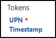

# 演習 2 - 秘密度ラベルを作成する

Contoso では、生産性を向上させるために Microsoft 365 Copilot の使用を開始しようとしており、人事機密データのセキュリティを確保する必要があります。 人事担当者は、従業員の記録、給与の詳細、パフォーマンス レビューなどの機密情報を扱います。そのため、承認された担当者のみがこれらのファイルにアクセスまたは編集できることが重要です。 秘密度ラベルは、このような情報を保護し、Copilot などのツールを使用している場合でも適切な保護が確実に行われるようにする 1 つの方法です。

このラボでは、Contoso の人事部門でドキュメントを保護し、Microsoft 365 ツールの使用時にもドキュメントの安全性を保つために使用できる秘密度ラベルを作成し構成します。

**タスク**:

1. 秘密度ラベルのサポートを有効にする
1. 秘密度ラベルを作成する
1. 秘密度ラベルを発行する

## タスク 1: 秘密度ラベルが付いたファイルの共同編集を有効にする

このタスクでは、秘密度ラベルが付いたファイルの共同編集を有効にします。 この機能を使用すると、複数のユーザーがドキュメントを保護しながらドキュメントの共同作業を行うことができます。 SharePoint と OneDrive のファイルの秘密度ラベルも有効になります (まだ有効になっていない場合)。

1. Microsoft Purview ポータルの左側サイド バーで、**[設定]** を選択します。

1. **[設定]** ページで **[Information Protection]** を選択します。

1. **[Information Protection の設定]** ページで、**[秘密度ラベルが付いたファイルの共同編集]** タブを選択します。

1. **[秘密度ラベルが付いたファイルの共同編集を有効にする]** チェック ボックスをオンにします。

   これで、SharePoint と OneDrive での秘密度ラベルのサポートも有効になります。

1. ページの下部で **[適用]** を選びます。

秘密度ラベルが付いたファイルの共同編集が正常に有効になりました。 複数のユーザーがリアルタイムでドキュメントを安全に編集できるようになり、OneDrive と SharePoint で秘密度ラベルのサポートがアクティブになりました

## タスク 2: 秘密度ラベルを作成する

このタスクでは、Contoso の人事部門で内部ドキュメントを保護するための秘密度ラベルを作成します。 これらのラベルは、従業員データなどの機密情報にアクセスし共有できるユーザーを制御するのに役立ちます。 このラベルを適用すると、Microsoft 365 Copilot を使用している場合でも、承認された人事担当者のみがこれらのドキュメントにアクセスできるようになります。

1. Microsoft Purview ポータルの左サイドバーで、**[ソリューション]** を選択してから、**[情報の保護]** を選択します。

1. 左側のサイド バーから **[秘密度ラベル]** を選択します。

1. **[秘密度ラベル]** ページで **[+ ラベルの作成]** を選択します。

1. **[新しい秘密度ラベル]** 構成が起動します。 **[このラベルの基本的な詳細を指定します]** で、次のように入力します。

    - **名前**: `Internal`
    - **表示名**: `Internal`
    - **ユーザー向けの説明**: `Internal sensitivity label.`
    - **管理者向けの説明**: `Internal sensitivity label for Contoso.`

1. [**次へ**] を選択します。

1. **[このラベルのスコープを定義]** ページで、**[ファイル]** と **[メール]** のみを **[アイテム]** で選択します。 **[会議]** が選択されている場合は、選択を解除します。

1. [**次へ**] を選択します。

1. **[ラベル付きのアイテムの保護設定を選択する]** ページで、 **[次へ]** を選択します。

1. **[ファイルと電子メールの自動ラベル付け]** ページで、**[次へ]** をクリックします。

1. **[グループとサイトの保護設定を選択]** ページで、**[次へ]** をクリックします。

1. **[Auto-labeling for schematized data assets (preview)] (スキーマ化されたデータ アセットの自動ラベル付け (プレビュー))** ページで、**[次へ]** を選択します。

1. **[設定の確認と終了]** ページで、**[ラベルの作成]** を選択します。

1. **[秘密度ラベルが作成されました]** ページ上で、**[Don't create a policy yet]** を選択し、**[完了]** を選択します。

会社のドキュメントを保護するための内部秘密度ラベルが正常に作成されました。 このラベルは、人事データのラベルなど、より具体的なラベルのベースになります。

## タスク 3: 人事用従業員データのサブラベルを作成する

このタスクでは、人事ドキュメントを保護するためのサブラベルを**内部**秘密度ラベルの下に作成します。 ユーザーのメールやアクセス タイムスタンプなどのパーソナライズされた詳細な個人情報をドキュメントに表示するための動的透かしが追加されます。 この機能は、承認されていない共有を阻止し、ドキュメントの使用状況を可視化します。

1. **[秘密度ラベル]** ページで、新しく作成した**内部**秘密度ラベルを見つけます。

1. **[内部]** 秘密度ラベルの横にある縦の省略記号 (**...**) を選択し、ドロップダウン メニューから **[+ サブラベルの作成]** を選択します。

   ![秘密度ラベルのサブラベルを作成するための [アクション] メニューを示すスクリーンショット。](../Media/create-sublabel-button.png)

1. **[新しい秘密度ラベル]** ウィザードが起動します。 **[このラベルの基本的な詳細を指定します]** で、次のように入力します。

   - **名前**: `Employee data (HR)`
   - **表示名**: `Employee data (HR)`
   - **ユーザー向けの説明**: `This HR label is the default label for all specified documents in the HR Department.`
   - **管理者向けの説明**: `This label was created with input from the Head of HR. Contact the HR department for any changes to the label settings.`

1. [**次へ**] を選択します。

1. **[このラベルのスコープを定義]** ページで、既定のスコープ場所を選択したままにして、**[次へ]** を選択します。

1. [**ラベル付きのアイテムの保護設定を選択する**] ページで、[**制御アクセス権**] オプションを選択し、**[次へ]** を選択します。

1. **[アクセスの制御]** ページで **[Configure access control settings] (アクセス制御設定を構成)** を選択します。

1. 次のオプションを使用して暗号化設定を構成します。

   - **アクセス許可を今すぐ割り当てますか、それともユーザーが決定するようにしますか?** :アクセス許可を今すぐ割り当てる
   - **コンテンツに対するユーザーのアクセス許可の期限**:まったくない
   - **オフライン アクセスを許可する**:数日のみ
   - **ユーザーがコンテンツへオフラインでアクセスできる日数**:15
   - **[アクセス許可の割り当て]** リンクを選択します。

   

1. **[アクセス許可の割り当て]** ポップアップ ページで、**[+ 組織内のすべてのユーザーとグループを追加する]** を選択し、**[保存]** を選択します。

1. **[アクセスの制御]** ページで、**[動的透かしを使用する]** のチェックボックスをオンにし、**[テキストのカスタマイズ (省略可能)]** を選択します。

1. **[カスタム テキストを透かしに追加する (省略可能)]** ページで、カスタム テキスト フィールドに「`Confidential | HR only |`」と入力します。

1. **[UPN]** と **[タイムスタンプ]** のトークンを選択し、ページの下部にある **[保存]** を選択します。

   

1. **[アクセスの制御]** ページで、**[次へ]** を選択します。

1. **[ファイルと電子メールの自動ラベル付け]** ページで、**[次へ]** をクリックします。

1. **[グループとサイトの保護設定を選択]** ページで、**[次へ]** をクリックします。

1. **[Auto-labeling for schematized data assets (preview)] (スキーマ化されたデータ アセットの自動ラベル付け (プレビュー))** ページで、**[次へ]** を選択します。

1. **[設定の確認と終了]** ページで、**[ラベルの作成]** を選択します。

1. **[秘密度ラベルが作成されました]** ページ上で、**[Don't create a policy yet]** を選択し、**[完了]** を選択します。

人事ドキュメント専用のサブラベルが正常に作成され、従業員データが保護され、許可されているユーザーのみが従業員データにアクセスできるようになりました。 人事部門は、このラベルを適用して、従業員の機密情報を安全に管理できるようになりました。

## タスク 4: 秘密度ラベルを発行する

これで秘密度ラベルを作成したので、Contoso 全体の人事ドキュメントに適用できるように、秘密度ラベルを発行します。 これにより、HR ファイルの保護が維持され、Microsoft 365 Copilot などのツールが、これらのラベルで設定されたルールに従って不正アクセスや偶発的な共有を防止できます。

1. **[秘密度ラベル]** ページで **[ラベルを発行]** を選択します。

1. 秘密度ラベルの発行構成が起動します。

1. **[発行する秘密度ラベルの選択]** ページで、**[発行する秘密度ラベルの選択]** リンクを選択します。

1. ポップアップ ページで、**[内部]** チェックボックスと **[内部/従業員データ (HR)]** チェックボックスをオンにし、下部にある **[追加]** を選択します。

1. **[発行する秘密度ラベルの選択]** ページに戻り、**[次へ]** を選択します。

1. [**管理単位の割り当て**] ページで、[**次へ**] を選択します。

1. **[ユーザーとグループに発行]** ページで **[次へ]** を選択します。

1. **[ポリシー設定]** ページで **[次へ]** を選択します。

1. **[Default settings for documents] (ドキュメントの既定の設定)** ページで、**[次へ]** を選択します。

1. **[Default settings for emails] (電子メールの既定の設定)** ページで、**[次へ]** を選択します。

1. **[Default settings for meetings and calendar events] (会議とカレンダー イベントの既定の設定)** ページで、**[次へ]** を選択します。

1. **[Fabric と Power BI コンテンツの既定の設定]** ページで、**[次へ]** を選択します。

1. **[ポリシーの名前の設定] ページ**で、以下を入力します。

   - **名前**: `Internal HR employee data`
   - **秘密度ラベル ポリシーの説明を入力してください**: `This HR label is to be applied to internal HR employee data.`

1. [**次へ**] を選択します。

1. **[確認と完了]** ページで、**[送信]** を選択します。

1. **[新しいポリシーが作成されました]** で、 **[完了]** を選択して、ラベル ポリシーの発行を完了します。

内部と人事の秘密度ラベルが正常に発行されました。 なお、変更内容がすべてのユーザーやサービスにレプリケートされるまで、最大で 24 時間かかることがあります。
