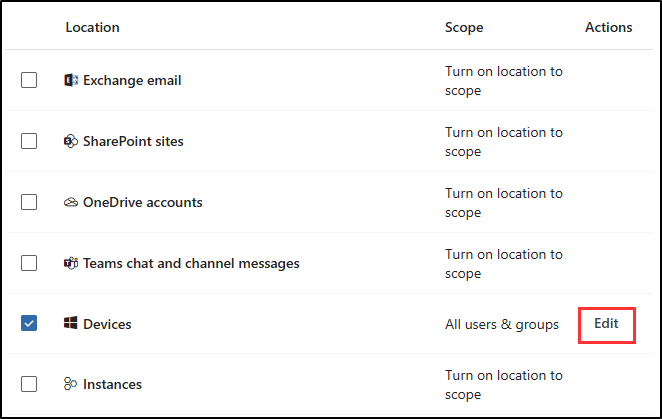

# 演習 4 - DLP ポリシーを作成する

Contoso は、従業員が生成 AI プラットフォームで機密情報を共有することを懸念しています。 DLP ポリシーを実装する前に、デバイスを Microsoft Purview エンドポイント DLP にオンボードする必要があります。 組織全体に展開する前に、運用上の問題がないことを確認するために、小規模なグループでシミュレーション モードでポリシーのテストを開始します。 テスト後、ポリシーをアクティブ化して会社全体に適用します。

**タスク:**

1. シミュレーション モードで DLP ポリシーを作成する
1. DLP ポリシーを修正する
1. シミュレーション モードでポリシーをアクティブ化する

## タスク 1: シミュレーション モードでエンドポイント DLP ポリシーを作成する

このタスクでは、機密データをユーザーがコピーして生成 AI プラットフォームに貼り付けることができないようにするエンドポイント DLP ポリシーを作成します。 Contoso はまず、少数の従業員から成るグループでシミュレーション モードでテストし、問題が発生しないことを確認します。

1. Microsoft Purview ポータルで、左側のサイドバーから **[ソリューション]** を選択し、**[データ損失防止]** を選択します。

1. **[ポリシー]**、**[+ ポリシーの作成]** の順に選択します。

1. **[テンプレートの利用またはカスタム ポリシーの作成]** ページで、**[カスタム]**、**[カスタム ポリシー]** の順に選択し、**[次へ]** を選択します。

1. **[DLP ポリシーの名前の設定]** ページで、以下を入力します。

    - **名前**: `Generative AI sharing DLP policy`
    - **説明**: `Prevent sharing of sensitive data with generative AI platforms.`

1. [**次へ**] を選択します。

1. [**管理単位の割り当て**] ページで、[**次へ**] を選択します。

1. **[ポリシーを適用する場所の選択]** ページで **[デバイス]** 場所のみを選択します。 他の場所が選択されている場合は、その場所の選択が解除されていることを確認します。

1. **アクション**列の**デバイス**行で、**[編集]** を選択してポリシー スコープを変更します。

   

1. **[デバイスのスコープ]** ページで **[特定のユーザーとグループ]** を選択し、ポップアップ ページで **[+ ユーザーとグループを含める]** を選択します。

1. **[ユーザーとグループの選択]** ページで、`Retail` グループのチェック ボックスをオンにし、ページの下部にある **[完了]** を選択します。

1. **[デバイスのスコープ]** で **[完了]** を選択します。

1. **[ポリシーを適用する場所の選択]** ページで、**[次へ]** を選択します。

1. **[ポリシー設定の定義]** ページで、**[高度な DLP ルールを作成またはカスタマイズする]** を選択し、**[次へ]** を選択します。

1. **[詳細な DLP ルールをカスタマイズする]** ページで、**[+ ルールの作成]** を選択します。

1. **[ルールの作成]** ページで、次を入力します。

    - **名前**: `Sensitive data protection rule`
    - **説明**: `Detect and restrict sharing of sensitive information with generative AI platforms.`

1. **[条件]** で、**[+ 条件の追加]** を選択し、**[次を含むコンテンツ]** を選択します。

1. 新しく開かれた **[コンテンツに含まれている]** 領域で、**[追加]** を選択し、**[機密情報の種類]** を選択します。

1. 右側の **[機密情報の種類]** ポップアップ ページで、`Credit` を検索し、機密情報の種類の **[クレジット カード番号]** チェックボックスをオンにします。

1. ページの下部にある **[追加]** を選択します。

1. **[アクション]** セクションで、**[+ アクションを追加]** ドロップダウンを選択したあと、**[デバイスでのアクティビティの監査または制限]** を選択します。

1. 新しく開いた **[デバイスでのアクティビティの監査または制限]** 領域の **[Service ドメインとブラウザーアクティビティ]** セクションで、**制限付きクラウド サービス ドメインへの アップロードまたは未許可のブラウザーからのアクセス**のチェック ボックスをオンにし、このオプションの下にある **[ + 機密性の高いサービス ドメインに対して異なる制限を選択する]** を選択します。

1. **[機密性の高いサービス ドメインの制限]** ポップアップ ページで、**[+ グループの追加]** を選択します。

1. **[機密性の高いサービス ドメイン グループの選択]** で **[生成 AI Web サイト]** のチェック ボックスをオンにし、ポップアップ ページの下部にある **[追加]** を選択します。

1. **[機密性の高いサービス ドメインの制限]** ページに戻り、**[生成 AI Web サイト]** が一覧に含まれていることを確認したうえで、ポップアップ ページの下部にある **[保存]** を選択します。

1. **[ルールの作成]** ページに戻り、**[サポートされているブラウザーに貼り付け]** チェックボックスをオンにし、このオプションの下で **[+ 機密性の高いサービス ドメインに対して異なる制限を選択する]** を選択します。

1. **[機密性の高いサービス ドメインの制限]** ポップアップ ページで、**[+ グループの追加]** を選択します。

1. **[機密性の高いサービス ドメイン グループの選択]** で **[生成 AI Web サイト]** のチェック ボックスをオンにし、ポップアップ ページの下部にある **[追加]** を選択します。

1. **[機密性の高いサービス ドメインの制限]** ページで **[保存]** を選択します。

1. **[ルールの作成]** に戻り、**[サービス ドメインとブラウザー アクティビティ]** セクションで、**[制限されたクラウド サービス ドメインにアップロードするか、制限されていないブラウザーからアクセスする]** および **[サポートされているブラウザーに張り付ける]** の両方に対してアクションを **[監査のみ]** から **[ブロック]** に更新します。

1. **[ユーザー通知]** セクションで、**[ユーザーへのお知らせに通知を使い、機密情報の適切な使用についてのユーザーの教育に役立てる]** を設定します。 **オン**に

1. **[エンドポイント デバイス]** で、**[ユーザーにポリシー ヒント通知を表示する]** のチェックボックスをオンにします。

1. **[Microsoft 365 サービス]** で、 **[ポリシーのヒントを使用して Office 365 でユーザーに通知する]** のチェックボックスを選択します。

1. ポップアップ ページの下部にある **[保存]** を選択します。

1. **[詳細な DLP ルールをカスタマイズする]** ページに戻り、**[次へ]** を選択します。

1. **[ポリシー モード]** ページで、**[シミュレーション モードでポリシーを実行する]** を選択し、**[次へ]** を選択します。

1. **[レビューと完了]** ページでポリシーの設定を確認し、**[送信]** を選択してポリシーを作成します。

1. ポリシーが作成されたら、**[新しいポリシーの作成]** ページで **[完了]** を選択します。

エンドポイント DLP ポリシーがシミュレーション モードで正常に作成されました。

## タスク 2 : DLP ポリシーを修正する

小規模なグループでポリシーをテストしたら、Contoso は、ポリシーを拡張してすべての従業員を対象に含める準備ができています。 このタスクでは、会社全体に適用するようにポリシーを変更します。その結果、すべての従業員の機密データが保護されます。

1. **[ポリシー]** ページで、先ほど作成した **[生成 AI 共有 DLP ポリシー]** のチェックボックスをオンにし、**[ポリシーの編集]** を選択してポリシー構成を開きます。

1. **[DLP ポリシーの名前の設定]** ページで **[次へ]** を選択します。

1. [**管理単位の割り当て**] ページで、[**次へ**] を選択します。

1. **アクション**列の**デバイス**行で、**[編集]** を選択してポリシー スコープを変更します。

1. **[デバイスのスコープ]** ページで、**[すべてのユーザーとグループ]** を選択し、ページの下部にある **[完了]** を選択します。

1. **[ポリシー モード]** ページが表示されるまで、**[次へ]** を選択します。

1. **[ポリシー モード]** ページで、**[シミュレーション モードでポリシーを実行する]** を選択し、**[次へ]** を選択します。

1. **[確認と完了]** ページで、**[送信]** を選択し、**[ポリシーが更新されました]** ページで **[完了]** を選択します。

DLP ポリシーが、すべての従業員に対応するように正常に更新されました。

## タスク 3: シミュレーション モードでポリシーをアクティブ化する

ポリシーがテストされ、拡張されたので、Contoso はポリシーを有効にする準備ができました。 このタスクでは、機密データを生成 AI プラットフォームと共有しようとする試みの阻止を開始するように、ポリシーをアクティブ化します。

1. **[ポリシー]** ページで、**[生成 AI 共有 DLP ポリシー]** を選択します。

1. 生成 AI 共有 DLP ポリシーの説明が表示されているポップアップ ページで、**[シミュレーションの表示]** を選択します。

1. **[ポリシーを有効にする]** を選択し、**[確認]** を選択して選択を確定します。

1. DLP ポリシーが発行されたことを確認するポップアップ通知が表示されます。

   

DLP ポリシーが正常にアクティブ化されました。 機密データは、コピーして生成 AI プラットフォームに貼り付けられる危険性がなくなりなりました。
