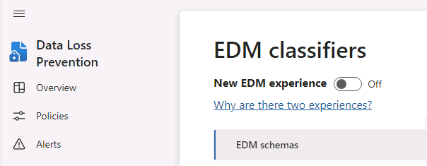

---
lab:
  title: 演習 3 - 機密情報の種類を管理する
  module: Module 1 - Implement Information Protection
---

<!--
# Lab 1 - Exercise 3 - Manage Sensitive Information Types
-->

# 演習 1 - 機密情報の種類を管理する

Contoso Ltd. は以前、チケット ソリューションでサポート チケットに取り組んでいる際に、従業員が誤って顧客の個人情報を送信するという問題がありました。 将来的にユーザーを教育するために、電子メールやドキュメントで従業員 ID を識別するためのカスタム機密情報の種類が必要です。これは 3 つの大文字と 6 つの数字で構成されます。 誤検知率を下げるために、キーワード "Employee" と "ID" が使用されます。 このタスクでは、新しいカスタム機密情報の種類、EDM ベースの分類用のデータベース、およびキーワード辞書を作成します。 

## タスク 1 - カスタム機密情報の種類を作成する

この演習では、セキュリティ/コンプライアンス センター PowerShell モジュールを用い、キーワード "Employee" と "ID" に近い従業員 ID のパターンを認識するカスタム機密情報を新しく作成します。

<!--
1. You should still be signed in to Client 1 VM (LON-CL1) as the **lon-cl1\admin** account.
-->

1. **Microsoft Edge** で、右上隅にある省略記号を選択し、**[新しい InPrivate] ウィンドウ**を選択して、[InPrivate] ウィンドウを開きます。

1. https://purview.microsoft.com に移動して、Microsoft Purview ポータルに **Joni Sherman**、JoniS@WWLxZZZZZZ.onmicrosoft.com としてサインインします (ZZZZZZ はラボ ホスティング プロバイダーによって提供される固有のテナント ID)。 Joni のパスワードは、ラボ ホスティング プロバイダーから支給されます。

1. 左側のウィンドウから **[ソリューション]** を選択し、**[データ損失防止]** を選択します。

1. **[分類子]** を展開し、**[機密情報の種類]** を選択します。

    >**ヒント:** **[機密情報の種類]** が Purview ポータルに表示されない場合は、以前のラボのコンプライアンス管理者に対する Joni の権限の更新がブラウザーで更新されていない可能性があります。  JoniS としてサインアウトし、サインインする必要がある場合があります。

1. "**データ分類とは?** " というメッセージが表示されたら、 **[閉じる]** を選択します。 

1. **[情報の種類を作成]** を選択し、新しい機密情報の種類を作成するウィザードを開きます。

1. **[機密情報の種類の名前を設定]** 手順で、次のように入力します。

    - **[名前]** : Contoso 従業員 ID
    - **[説明]** : Contoso の従業員 ID のパターン。

1. **[次へ]** を選択します。

1. **[この機密情報の種類のパターンを定義する]** ページで、**[パターンを作成する]** を選択します。

1. 右側の **[新しいパターン]** ウィンドウで、 **[+ 主要要素を追加]** を選択し、 **[正規表現]** を選択します。

1. **[正規表現の追加]** で、次のように入力します。

    - **[ID]** : Contoso ID
    - **正規表現**: ```[A-Z]{3}[0-9]{6}```
    - **文字列の一致**のラジオ ボタンを選択します。

1. **完了** を選択します。

1. **[補助要素]** の下で、**[+ 補助要素または要素のグループの追加]** を選択し、**[キーワード リスト]** を選択します。

1. **[キーワード リストの追加]** で、次のように入力します。

    - **ID**: 従業員 ID のキーワード
    - **大文字と小文字の区別をしない**:
        - *Employee*
        - *ID*
    - **単語一致**のラジオ ボタンを選択します。

1. **完了** を選択します。

1. **[新しいパターン]** ウィンドウで、**[文字の近接性]** 値を *100* 文字に減らします。

1. **[作成]** ボタンを選択します。

1. **[この機密情報の種類のパターンを定義する]** 手順に戻り、**[次へ]** を選択します。

1. **[コンプライアンス ポリシーに表示する推奨信頼レベルの選択]** 手順で、既定値を使用して **[次へ]** を選択します。

1. **[設定の確認と終了]** 手順で設定を確認し、**[作成]** を選択します。 正常に作成されたら、**[完了]** を選択します。

1. [InPrivate] ブラウザー画面は開いたままにしておきます。

100 文字の範囲内で、3 つの大文字、6 つの数字、キーワード "Employee"、"IDs" のパターンで、従業員 ID を特定する、新しい機密情報の種類を作成しました。

## タスク 2 – EDMベースの分類情報の種類を作成する。

追加の検索パターンとして、従業員データのデータベース スキーマで完全データ一致 (EDM) ベースの分類を作成します。 データベース ソース ファイルは以下の従業員のデータ フィールドでフォーマットされます:Name、Birthdate、StreetAddress、EmployeeID。

<!--
1. You should still be signed in to Client 1 VM (LON-CL1) as the **lon-cl1\admin** account, and you should be signed in to Microsoft 365 as **Joni Sherman**.

1. To create the required Azure AD security group, sign out of Joni Sherman's account by selecting the user image in the upper right corner and select **Sign out**.

1. Close the browser window and open a new browser window.

1. In **Microsoft Edge**, navigate to **https://admin.microsoft.com**.

1. When the **Pick an account** page is displayed, select **Use another account** and sign in as **MOD Administrator** admin@WWLxZZZZZZ.onmicrosoft.com (where ZZZZZZ is your unique tenant ID provided by your lab hosting provider).  Admin's password should be provided by your lab hosting provider.
-->

1. **MOD 管理者**としてサインインしている通常の**Microsoft Edge** ウィンドウを開きます。

1. 「 https://admin.microsoft.com 」を参照してください。

1. 左ウィンドウから、**[チームとグループ]** を選択し、**[アクティブなチームとグループ]** を選択します。

1. グループのリストの上にある **[セキュリティ グループ]** タブを選択し、**[+ セキュリティ グループの追加]** を選択します。

    ![[グループの追加] ボタンのスクリーンショット。](../Media/add-security-group.png)

1. **[基本設定]** 手順で、次のように入力します。
    - **名前**: EDM_DataUploaders
    - **説明**: EDM のデータをアップロードするユーザー。

1. [**次へ**] を選択します。

1. **[設定の編集]** 手順で、既定の設定のままにして、**[次へ]** を選択します。

1. **[確認とグループの追加の完了]** 手順で、設定を確認し、**[グループの作成]** を選択します。

1. 作成したら、**[閉じる]** を選択します。

1. **[セキュリティ グループ]** タブが選択されていることを確認し、**[最新の情報に更新]** を選択します。 

1. 新しく作成した **[EDM_DataUploaders]** グループを一覧から選択して、右側に **[EDM_DataUploaders]** ポップアップ ページを開きます。

1. **[メンバー]** タブを選択し、**[すべてのメンバーの表示と管理]** を選択します。

1. **[(+) メンバーの追加]** を選択します。

1. **Joni Sherman** を選択し、下部にある **[追加 (1)]** ボタンを選択します。 

1. ポップアップ ウィンドウの左上隅にある戻る矢印ボタンを選択します。

1. **Joni Sherman** が **[メンバー]** の下に一覧表示されていることを確認します。

1. **[EDM_DataUploaders]** ウィンドウを、右上にある **[X]** を選択して閉じます。

<!--
1. Select the circle with the MOD Administrator initials **MA** and select **Sign out**.

1. Close the browser window and open a new one.

1. Navigate to the Microsoft Purview portal at https://compliance.microsoft.com.

1. When the **Pick an account** page is displayed, select **Joni Sherman** and sign in.
--> 

1. **Joni Sherman** としてサインインしている **Microsoft Edge** [InPrivate] ウィンドウを開きます。

1. 中断した場所から移動した場合は、左ウィンドウから **[データ損失防止]** を選択します。

1. **[分類子]** を展開し、**[EDM 分類子を選択]** します。

    >**注:** 完全データ一致 (EDM) ベースの機密情報の種類 (SIT) を作成して使用できるようにするのは、マルチフェーズのプロセスです。 既存のクラシック エクスペリエンスで新しいエクスペリエンスを使用できます。 このラボでは、クラシック エクスペリエンスを使用して EDM ベースの SIT を作成する手順について説明します。 新しいエクスペリエンスで EDM ベースの SIT を作成する方法の詳細については、次を参照してください:[完全データ一致の機密情報の種類のワークフローの新しいエクスペリエンスを作成する](https://learn.microsoft.com/en-us/microsoft-365/compliance/sit-create-edm-sit-unified-ux-workflow?view=o365-worldwide)

1. クラシック エクスペリエンスの場合は、 **[新しい EDM エクスペリエンス]** が **[オフ]** に設定されていることを確認します。

    

1. **[EDM スキーマを作成する]** を選択します。

1. **[New EDM schema] (新しい EDM スキーマ)** ページで、次のように入力します。
    - **名前**: employeedb
    - **説明**: 従業員データベース スキーマ

1. **[すべてのスキーマ フィールドで区切り記号と句読点を無視する]** をオンにします。

1. **[無視する区切り記号と句読点を選択]** のドロップダウンをクリックして選択します。

    - **Hyphen**
    - **期間**
    - **Space**
    - **左かっこ**
    - **右かっこ**

1. 最初の **[スキーマ フィールド名]** に*名前* と入力し、**[フィールドは検索可能]** チェックボックスを選択します。

    

1. 下部にある **[+ スキーマ データ フィールドを追加]** を選択します。

1. **[スキーマ フィールド No. 2]** で、**[スキーマ フィールド名]** に「*Birthdate*」と入力します。

1. **[スキーマ データ フィールドを追加]** を選択します。

1. **[スキーマ フィールド No. 3]** で、**[スキーマ フィールド名]** に「*StreetAddress*」と入力します。

1. **[スキーマ データ フィールドを追加]** を選択します。

1. **[スキーマ フィールド名]** で、**[スキーマ フィールド #4]** の下に *[EmployeeID]* と入力し、**[フィールドは検索可能]** チェックボックスを選択します。

    

1. **[保存]** を選択します。

1. **[EDM 分類子を選択]** の左ウィンドウから **[EDM 機密情報の種類]** を選択します。

1. **[+ EDM 機密情報の種類を作成する]** を選択すると、**EDM ルール パッケージ** ウィザードが開きます。  

    

1. **[データ ストア スキーマを定義する]** 手順で、**[既存の EDM スキーマを選択する]** を選択します。

1. **[employeedb]** を選択し、**[追加]** を選択します。

1. データ ストア スキーマを確認してから、**[次へ]** を選択します。

1. **[この EDM 機密情報の種類のパターンを定義する]** 手順で、**[パターンを作成する]** を選択します。

1.  **[新しいパターン]** ウィンドウの **[プライマリ要素]** フィールドで、**[EmployeeID]** を選択します。

1. **[+ 機密情報の種類を選択する]** を選択します。

1. **検索**バーで、*Contoso*と入力し、**Enter** を押します。

1. **[Contoso 従業員 ID]** を選択し、**[完了]** を選択します。

1. **[新しいパターン]** ウィンドウで、**[完了]** を選択します。

1. **[この EDM 機密情報の種類のパターンを定義する]** 手順で、**[次へ]** を選択します。

1. **[推奨される信頼水準と文字の近接性を選択する]** 手順で、既定値を維持し、**[次へ]** を選択します。

1. **[名前と EDM 機密情報の種類の説明]** 手順で、次のように入力します。
    - **名前**: Contoso 従業員 EDM
    - **管理者向けの説明**: 従業員の個人情報の、EDM ベースの機密情報の種類

1. [**次へ**] を選択します。

1. 設定を確認して、**[送信]** を選択しす。 作成したら、**[完了]** を選択します。

1. Microsoft Purview ポータルのブラウザーは開いたままにします。

データベース ファイル ソースから従業員データを特定するための、EDM ベースの分類による機密情報の種類を作成しました。

## タスク 3 – EDM ベースの分類情報の種類を作成する。

EDM ベースの分類を機密データを含むデータベースと関連付けるには、機密データの種類の実際のデータを EDM アップロード エージェント ツールを通してハッシュ化し、アップロードすることが次に必要となります。

<!--
1. You should still be signed in to Client 1 VM (LON-CL1) as the **lon-cl1\admin** account, and you should be signed in to Microsoft 365 as **Joni Sherman**.

1. In **Microsoft Edge**, navigate to **https://go.microsoft.com/fwlink/?linkid=2088639** to access the EDM download agent.
-->

1. [InPrivate] ウィンドウで新しいタブを開き、https://go.microsoft.com/fwlink/?linkid=2088639 に移動してEDM ダウンロード エージェントにアクセスします。

1. ファイルがダウンロードされたら、そのファイルを選択し、インストーラーを起動します。

1. [**次へ**] を選択します。

1. **[使用許諾契約書の条項に同意する]** を選択し、**[次へ]** を選択します。

1. 既定の **[宛先フォルダー]** パスは変更せずに、**[次へ]** を選択します。

1. **[インストール]** を選択します。

1. **[ユーザー アカウント制御]** ウィンドウが開いたら、**[はい]** を選択します。

1. インストールが完了したら、**[完了]** を選択します。

1. [スタート] メニューを開き、**メモ帳**を検索して選択ます。

1. [メモ帳] のウィンドウに次のテキストを入力します。

    ``` text
    Name,Birthdate,StreetAddress,EmployeeID
    Joni Sherman,01.06.1980,1 Main Street,CSO123456
    Lynne Robbins,31.01.1985,2 Secondary Street,CSO654321
    ```

1. **[ファイル]** と **[名前を付けて保存]** を選択してファイルを保存します。

1. 左側のペインから **[ドキュメント]** を選択し、"**ファイル名**" フィールドに「*EmployeeData.csv*」と入力します

1. **[ファイルの種類:]** でドロップダウンを選択し、**[すべてのファイル ( *.* )]** を選択します。

1. **[エンコード]** でドロップダウンを選択し、**[UTF-8]** を選んだら、**[保存]** を選択します。

<!--
1. Close Notepad.

1. Select the windows symbol in the 
bar with the right mouse button and select **Windows PowerShell (Admin)** and run as administrator.

1. When the **User Account Control** window opens, select **Yes**.
-->

1. 後で使用するためにメモ帳を開いたままにしておきます。

1. タスク バーから管理者特権の PowerShell ウィンドウを選択します。

1. EDM アップロード エージェント ディレクトリまで移動します:

    ``` text
    cd "C:\Program Files\Microsoft\EdmUploadAgent"
    ```

1. 以下のコマンドレットを実行して、自分のアカウントでデータベースをテナントにアップロードすることを承認します：

    ``` text
    .\EdmUploadAgent.exe /Authorize
    ```

1. **[アカウントを選択する]** ウィンドウが表示されたら、JoniS@WWLxZZZZZZ.onmicrosoft.com としてサインインします (ZZZZZZ はラボ ホスティング プロバイダーから支給された固有のテナント ID)。  Joni のパスワードは、ラボ ホスティング プロバイダーから支給されます。

1. 以下のスクリプトを PowerShell で実行して、EDB ベースの分類による秘密情報の種類のデータベース スキーマの定義をダウンロードします:

    ``` text
    .\EdmUploadAgent.exe /SaveSchema /DataStoreName employeedb /OutputDir "C:\Users\Admin\Documents\"
    ```

    注: 最後のコマンドが失敗したら、**EDM_DataUploaders** グループ メンバーシップが適用されるまでもっと時間がかかる可能性があります。 スキーマ ファイルをダウンロードすることができるようになるまで最大 1 時間かかる場合があります。  失敗した場合は、次のタスクに進み、後でこの手順に戻ります。

1. PowerShell で以下のスクリプトを実行して、データベース ファイルをハッシュ化し、EDB ベースの分類による秘密情報の種類にアップロードします。

    ``` text
    .\EdmUploadAgent.exe /UploadData /DataStoreName employeedb /DataFile "C:\Users\Admin\Documents\EmployeeData.csv" /HashLocation "C:\Users\Admin\Documents\" /Schema "C:\Users\Admin\Documents\employeedb.xml"
    ```

1. 次のコマンドを使用して、アップロードの進行状況を確認します。

    ``` text
    .\EdmUploadAgent.exe /GetSession /DataStoreName employeedb
    ```

1. 状態が **[完了]** になると、EDM データを使用する準備が整います。

    

<!--
1. Close the PowerShell window.
-->

1. 後で使用するために PowerShell を開いたままにしておきます。

EDB ベースの分類による秘密情報の種類のためにデータベース ファイルがハッシュ化し、アップロードされました。

## タスク 4 – キーワード辞書を作成する

個人情報漏えいの違反の中には、同僚が病欠を報告した後に、ユーザーがメールを送信した際に発生しています。  発生時には、理由に病気または疾病が送信されています。それが起こらないようにしたいのです。

<!--
1. You should still be signed in to Client 1 VM (LON-CL1) as the **lon-cl1\admin** account, and you should be signed in to Microsoft 365 as **Joni Sherman**.

1. In **Microsoft Edge**, the Microsoft Purview portal tab should still be open. If so, select it and proceed to the next step. If you closed it, then in a new tab, navigate to **https://purview.microsoft.com**.
-->

1. **Joni Sherman** でサインインしている [InPrivate] ウィンドウを開き、閉じられた場合にhttps://purview.microsoft.com に戻ります。

1. 左ウィンドウ*から **[データ損失防止]** を選択します。

1. **[分類子]** を展開し、**[機密情報の種類]** を選択します。

1. **[情報の種類を作成]** を選択し、新しい機密情報の種類を作成するウィザードを開きます。

1. **[機密情報の種類の名前を設定]** ページで、次のように入力します。

    - **[名前]** : Contoso 病名の一覧
    - **[説明]** : 従業員の考えられる病名の一覧。

1. **[次へ]** を選択します。

1. **[この機密情報の種類のパターンを定義する]** ページで、**[パターンを作成する]** を選択します。

1. **[新しいパターン]** ページで **[プライマリ要素]** の下のドロップダウン フィールドを選択し、**[キーワード辞書]** を選択します。

1. **[キーワード辞書の追加]** ページで、次のように入力します。

   - **名前**: 病名の辞書
   - **キーワード**:
      - flu
      - influenza
      - cold (寒い)
      - bronchitis
      - otitis  

1. **[完了]** を選択します。

1. **[補助要素]** の下で、 **[補助要素または要素のグループを追加]** ドロップダウンを選択し、 **[キーワード リスト]** を選択して、キーワード辞書のサポートを追加します。

1. **[キーワード一覧の追加]** ページで、次のように入力します。

   - **ID**: 従業員の不在
   - **大文字と小文字の区別をしない**:
     - employee
     - absence
     - reason

1. **[完了]** を選択します。

1. **[新しいパターン]** ページで、構成を確認し、 **[作成]** を選択します。

1. **[この機密情報の種類のパターンを定義する]** 手順で、 **[次へ]** を選択します。

1. **[コンプライアンス ポリシーに表示する推奨信頼レベルの選択]** 手順で、既定値をそのまま使用して **[次へ]** を選択します。

1. **[設定の確認と終了]** ページで、設定を確認し、 **[作成]** を選択します。  処理が完了したら、**[完了]** を選択します。

<!--
1. Leave the browser window in the Microsoft Purview portal open.
-->

キーワード辞書に基づいて新しい機密情報の種類を作成し、さらにキーワードを追加して、誤検知率を下げることができました。 次のタスクに進みます。

## タスク 5 - カスタム機密情報の種類で作業する

カスタム機密情報の種類はポリシーで利用する前に必ずテストする必要があります。テストをしなかった場合、カスタム検索のパターンが動作せず、データの損失や漏えいが発生する可能性があります。

<!--
1. You should still be signed in to Client 1 VM (LON-CL1) as the **lon-cl1\admin** account, and you should be signed in to Microsoft 365 as **Joni Sherman**.
-->

1. タスク バーから**メモ帳**を開き、上部のバーの **[+] アイコン** を選択して新しいタブを開きます。

1. メモ帳のウィンドウに次のテキストを入力します。

    ``` text
    Employee Joni Sherman EMP123456 is absent because of the flu/influenza.
    ```

1. **[ファイル]**、**[名前を付けて保存]** の順に選択します。

1. 左ウィンドウで **[ドキュメント]** を選択します。

1. **[ファイル名]** フィールドに *[SickTestData]* と入力し、**[保存]** を選択します

<!--
1. Close the Notepad window.

1. In **Microsoft Edge**, the Microsoft Purview portal tab should still be open. If so, select it and proceed to the next step. If you closed it, then in a new tab, navigate to **https://purview.microsoft.com**.

-->

1. [InPrivate] ブラウザー画面を開きます。この画面は引き続き **[データ損失防止]** で表示されているはずです。

1. 展開する **[分類子]** を選択し、サブメニューから **[機密情報の種類]** を選択します。

1. 右上の **[検索]** ボックスに、「*Contoso*」と入力し、Enter キーを押します。

1. **[Contoso 従業員 ID]** を選択します。

1. **[Test]** を選択します。

1. **[テストの対象ファイルのアップロード]** ペインで、 **[ファイルのアップロード]** を選択します。

1. **[ドキュメント]** を選択して、次に **[SickTestData]** ファイルを選択し、**[開く]** を選択します。

1. 下部にある **[テスト]** を選択して、分析を開始します。

1. **[一致する検索結果]** のページで、見つかった一致する検索結果を確認します。

1. **[完了]** を選択してテストを終了します。

1. **[Contoso 従業員 EDM]** ウィンドウを閉じ、**[Contoso 病名一覧]** を選択します。

1. **[Test]** を選択します。

1. **[テストの対象ファイルのアップロード]** ペインで、 **[ファイルのアップロード]** を選択します。

1. **[ドキュメント]** を選択して、次に **[SickTestData]** ファイルを選択し、**[開く]** を選択します。

1. **[テスト]** を選択して、分析を開始します。

1. **[一致する検索結果]** のページで、見つかった一致する検索結果を確認します。 確認が完了したら、**[完了]** を選択します。

2 つの秘密情報の種類をテストし、検索パターンが目標とするパターンを認識することを検証しました。 機密情報の種類の作成が終了しました。次の演習に進めます。
