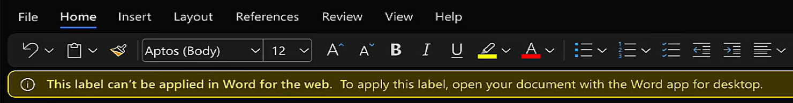

---
lab:
  title: 演習 5 - 秘密度ラベルを管理する
  module: Module 1 - Implement Information Protection
---

<!-- 
# Lab 1 - Exercise 5 - Manage Sensitivity Labels
-->

# 演習 2: 秘密度ラベルを管理する

このラボでは、Contoso Ltd. のシステム管理者である Joni Sherman のロールを実行します。組織はドイツのレドニッツヘムバッハに拠点を置いており、現在、人事部のすべての従業員ドキュメントが組織の情報保護ポリシーの一部として秘密度ラベルが付けてあることを確認するための秘密度計画を実施しています。

## タスク 1 - 秘密度ラベルのサポートを有効にする

このタスクでは、MSOnline モジュールと SharePoint Online PowerShell モジュールをインストールし、テナントでの秘密度ラベルのサポートを有効にします。

<!--
1. Sign in to the Client 1 VM (LON-CL1) as the **lon-cl1\admin** account.

1. Open an elevated PowerShell window by selecting the start menu with the right mouse button and then select **Windows PowerShell** and run as administrator.

1. Confirm the **User Account Control** window with **Yes** and press Enter.
-->

1. タスク バーから、以前に昇格した管理者特権の PowerShell ウィンドウを開きます。

1. 次のコマンドレットを入力して、最新の MS Online PowerShell モジュール バージョンをインストールします。

    ```powershell
    Install-Module -Name MSOnline
    ```

1. NuGet セキュリティ ダイアログと信頼されていないレポジトリ セキュリティ ダイアログを **Y** (はい) で確認し、**Enter** キーを押します。 この処理が完了するまでしばらく時間がかかる場合があります。

1. 次のコマンドレットを入力して、MS Online サービスに接続します。

    ```powershell
    Connect-MsolService
    ```

1. **[アカウントにサインイン]** フォームで、**Joni Sherman** JoniS@WWLxZZZZZZ.onmicrosoft.com としてサインインします (ZZZZZZ はラボ ホスティング プロバイダーから支給された固有のテナント ID)。 Joni のパスワードは、ラボ ホスティング プロバイダーから支給されます。

1. 次のコマンドレットを入力して、ドメイン値を保存します。

    ```powershell
    $domain = get-msoldomain
    ```

1. 次のコマンドレットを入力して、SharePoint 管理 URL を構成します。

    ```powershell
    $adminurl = "https://" + $domain.Name.split('.')[0] + "-admin.sharepoint.com"
    ```

1. 次のコマンドレットを入力して、SharePoint Online 管理センターにサインインします。

    ```powershell
    Connect-SPOService -url $adminurl
    ```

1. **MOD 管理者**としてサインインします。 admin@WWLxZZZZZZ.onmicrosoft.com (ZZZZZZ はラボ ホスティング プロバイダーから支給された固有のテナント ID)。 <!--Admin's password should be provided by your lab hosting provider.-->

1. 次のコマンドレットを入力して、秘密度ラベルのサポートを有効にします。

    ```powershell
    Set-SPOTenant -EnableAIPIntegration $true
    ```

1. "はい" の **Y** を入力して確認し、Enter キーを押します。

<!--
1. Close the PowerShell window.
-->

1. 後で使用するために PowerShell ウィンドウを開いたままにしておきます。

これで、Teams および SharePoint サイトでの秘密度ラベルのサポートが有効になりました。

## タスク 2 – 秘密度ラベルを作成する

このタスクでは、人事部が HR 従業員ドキュメントに適用する秘密度ラベルを要求しています。 内部ドキュメントの秘密度ラベルと人事部のサブラベルを作成します。

<!--
1. You should still be signed in to Client 1 VM (LON-CL1) as the **lon-cl1\admin** account.

1. In **Microsoft Edge**, navigate to **https://purview.microsoft.com** and sign in to the Microsoft Purview portal as **Joni Sherman** JoniS@WWLxZZZZZZ.onmicrosoft.com (where ZZZZZZ is your unique tenant ID provided by your lab hosting provider).  Joni's password should be provided by your lab hosting provider.
-->

1. **Joni Sherman** でサインインしている [InPrivate] ウィンドウを開き、閉じられた場合にhttps://purview.microsoft.com に戻ります。

1. 左側のウィンドウから **[ソリューション]** を選択し、**[Information Protection]** を選択します。

1. **[秘密度ラベル]** を選択します。

1. 既存ラベル一覧の上にある行から **[+ ラベルの作成]** を選択します。

1. **[ラベルに名前を付けてヒントを作成する]** ステップ、次の情報を入力します。

    - **[名前]** : internal
    - **表示名**: internal
    - **ユーザー向けの説明**:内部の秘密度ラベル。
    - **管理者向けの説明**:Contoso の内部の秘密度ラベル。

1. [**次へ**] を選択します。

1. **[このラベルのスコープを定義]** ステップで、**[アイテム]** を選択し、**[ファイル]** と **[メール]** を選択します。 このページでその他のオプションが選択されている場合は、それらのオプションの選択を解除します。

1. **[設定を確認して完了]** ステップが表示されるまで、**[次へ]** を選択します。

1. **[ラベルの作成]** を選択します。

1. **[秘密度ラベルが作成されました]** ステップで、**[まだポリシーを作成しない]** を選択し、**[完了]** を選択します。

1. [秘密度ラベル] ページで、新しく作成した **[内部]** ラベルを (選択せずに) 強調表示し、縦に並んだ **[...]** を選択します。

    

1. ドロップダウン メニューから **[+ サブラベルの作成]** を選択します。

1. **[このラベルの基本的な詳細を指定します]** ステップで、次の情報を入力します。

   - **[名前]** : 従業員データ (HR)
   - **表示名**: 従業員データ (HR)
   - **ユーザー向けの説明**:この HR ラベルは、人事部門で指定されたすべてのドキュメントの既定のラベルです。
   - **管理者向けの説明**:このラベルは Jones さん (人事部長) と相談して作成します。 ラベルの設定を変更する必要があるときは、彼女に連絡してください。

1. [**次へ**] を選択します。

1. **[このラベルのスコープを定義]** ページで、**[アイテム]**、**[ファイル]**、**[メール]** を順に選択します。 このページでその他のオプションが選択されている場合は、それらの選択を解除します。 [**次へ**] を選択します。

1. **[ラベル付きのアイテムの保護設定を選択する]** ステップで、**[アクセスの制御]** チェックボックスをオンにします。 [**次へ**] を選択します。

1. **[アクセスの制御]** ステップで **[Configure access control settings] (アクセス制御設定を構成)** を選択します。

1. 暗号化設定に次の情報を入力します。

   - **アクセス許可を今すぐ割り当てますか、それともユーザーが決定するようにしますか?** :アクセス許可を今すぐ割り当てる
   - **コンテンツに対するユーザーのアクセス許可の期限**:まったくない
   - **オフライン アクセスを許可する**:数日のみ
   - **ユーザーがコンテンツへオフラインでアクセスできる日数**:15

1. **[アクセス許可の割り当て]** リンクを選択します。

1. [アクセス許可の割り当て] サイド メニューで、 **[+ 任意の認証済みユーザーを追加]** を選択します。

1. **[保存]** を選択します。

1. **[アクセスの制御]** ステップで、**[次へ]** を選択します。

1. **[設定を確認して完了]** ステップが表示されるまで、**[次へ]** を選択します。

1. **[ラベルの作成]** を選択します。

1. **[秘密度ラベルが作成されました]** ステップで、**[まだポリシーを作成しない]** を選択し、**[完了]** を選択します。

組織の内部ポリシーの秘密度ラベルと、人事 (HR) 部門の秘密度サブラベルが正常に作成されました。

## タスク 3 – 秘密度ラベルを発行する

次に、内部と人事の秘密度ラベルを発行します。これにより、発行された秘密度ラベルを人事ユーザーが人事ドキュメントに適用できるようになります。

<!--
1. You should still be signed in to Client 1 VM (LON-CL1) as the **lon-cl1\admin** account, and you should be signed in to Microsoft 365 as **Joni Sherman**.  Sign in as JoniS@WWLxZZZZZZ.onmicrosoft.com (where ZZZZZZ is your unique tenant ID provided by your lab hosting provider).  Joni's password should be provided by your lab hosting provider.

1. In **Microsoft Edge**, the Microsoft Purview portal tab should still be open. If so, select it and proceed to the next step. If you closed it, then in a new tab, navigate to **https://purview.microsoft.com**.
-->

1. Purview の [秘密度ラベル] ページが引き続き表示されているはずです。

1. **[+ ラベルの作成]** を使用した行と同じ行で、**[ラベルの発行]** を選択します。

1. **[発行する秘密度ラベルの選択]** リンクを選択します。

1. 新しいペインで、**[内部]** チェックボックスと **[内部/従業員データ (HR)]** チェックボックスをオンにし、**[追加]** を選択します。

1. **[発行する秘密度ラベルの選択]** ステップで **[次へ]** を選択します。

1. **[ポリシーの名前を設定]** ステップが表示されるまで **[次へ]** を選択します。

1. 次の情報を入力してください。

   - **[名前]** : 内部の人事部従業員データ
   - **秘密度ラベル ポリシーの説明を入力してください**:この HR ラベルは、内部の人事部従業員データに適用されます。

1. [**次へ**] を選択します。

1. **[確認して完了]** ステップで、**[送信]** を選択します。

1. **[新しいポリシーが作成されました]** ステップで、**[完了]** を選択して、ラベル ポリシーの発行を完了します。

内部と人事の秘密度ラベルが正常に発行されました。 なお、変更内容がすべてのユーザーやサービスにレプリケートされるまで、最大で 24 時間かかることがあります。

## タスク 4 – 秘密度ラベルを使って作業する

このタスクでは、Word と Outlook の電子メールで秘密度ラベルを作成します。 作成されたドキュメントは OneDrive に保存され、電子メールで人事部の従業員に送信されます。

<!--
1. You should still be signed in to Client 1 VM (LON-CL1) as the **lon-cl1\admin** account, and you should be signed in to Microsoft 365 as **Joni Sherman** JoniS@WWLxZZZZZZ.onmicrosoft.com (where ZZZZZZ is your unique tenant ID provided by your lab hosting provider).  Joni's password should be provided by your lab hosting provider.

1. In **Microsoft Edge**, the Microsoft Purview portal tab should still be open. Select the address bar and navigate to **https://www.microsoft365.com**.
-->

1. **Joni Sherman** としてサインインしている [InPrivate] ウィンドウから新しいタブを開き、https://www.microsoft365.com に移動します。

1. **[サインイン]** を選択します。

1. [Microsoft 365 へようこそ] メッセージをスクロールして閉じます。

1. ページの左上隅で**アプリ起動ツール** メニュー (9 ドット) を選択し、**[Word]** を選択します。

1. **[空白のドキュメント]** を選択して、新しいドキュメントを作成します。

1. **[プライバシー オプション]** のメッセージが表示された場合は、**[閉じる]** を選択します。

1. Word 文書に次の内容を入力します。

    ``` text
    Important HR employee document.
    ```

1. 上部ペインの上部にある **[秘密度]** を選択し、ドロップダウン メニューを開きます。 **[内部] > [従業員データ (HR)]** を選択してラベルを適用します。

    

    >**注:** この演習のタスク 1 で実行したスクリプトによって、テナントの Word の秘密度ラベルがアクティブになっていることに注意してください。  Microsoft Word でのアクティブ化がオンラインで反映されるまでに 1 時間かかることがあります。  Word に [秘密度ラベル] メニューが表示されない場合は、後でこのラボに戻るか、この演習のタスク 1 を適切に完了していることを確認する必要があります。

    >"This label can't be applied in Word for the web...(このラベルは Word for the web では適用できません...)" という警告が表示される場合があります。その場合は、数分後に Word を再起動して、もう一度やり直してください。

    

1. Word ロゴの横にあるウィンドウの左上隅にある **[Document]** を選択して、名前を変更します。

1. ファイル名として「**HR Document**」を入力し、**Enter** キーを押します。

1. タブを閉じます。 

1. Microsoft 365 の**アプリ起動ツール** メニューを選択し、**[Outlook]** を選択して起動します。

1. ようこそメッセージが表示される場合は、**[X]** を選択して閉じます。

1. Outlook で、ウィンドウの左上にある **[新しいメール]** を選択します。

1. **[宛先]** フィールドに「**Allan**」という名前を入力し、ドロップダウン リストから **[Allan Deyoung]** を選択します。

1. **[件名を追加]** フィールドに「**人事用従業員データ**」と入力します

1. 電子メールの本文 (ページ下部の大きなコンテンツ パネル) に、次のメッセージを挿入します。

    ``` text
    Dear Mr. Deyoung, 

    Please find attached the important HR employee document. 

    Kind regards,

    Joni Sherman
    ```

1. 上部のメニューからクリップのシンボルを選択して、添付ファイルを追加します。 **[Suggested files] (示された)** ファイルの下にある **HR Document.docx** を選択して、このドキュメントを添付します。

    >情報の伝達に時間がかかるため、ファイル名がまだ **Document.docx** として表示されている可能性があります。 このファイルが **[おすすめのファイル]** にある唯一の .docx ファイルになるようにしてください。

1. **[送信]** を選択して、ドキュメントが添付されたメールを送信します。

1. ブラウザー画面は開いたままにします。

OneDrive に保存された秘密度ラベル付きの HR Word ドキュメントが正常に作成されました。 その後、人事のスタッフ メンバーに電子メールでドキュメントを送付しましたが、その電子メールにも秘密度ラベルが設定されていました。

## タスク 5 – 自動ラベル付けを構成する

このタスクでは、欧州の一般データ保護規則 (GPDR) に関連する情報が含まれていることが検出されたドキュメントや電子メールに自動的にラベルを付ける秘密度ラベルを作成します。

<!--
1. You should still be signed in to Client 1 VM (LON-CL1) as the **lon-cl1\admin** account.

1. In **Microsoft Edge**, navigate to **https://purview.microsoft.com** and sign in to the Microsoft Purview portal as **Joni Sherman**.

1. In the Microsoft Purview portal, on the left navigation pane, select **Information Protection**.
-->

1. [Purview] タブに戻るか、https://purview.microsoft.com に移動して開き直します。

1. [秘密度ラベル] ページにまだ表示されていない場合は、左端のペインから **[Information Protection]** を選択し、**[秘密度ラベル]** を選択します。

1. 既存の **[内部]** ラベルを (選択せずに) 強調表示し、省略記号 (3 つの点) を選択します。

1. **[+ サブラベルの作成]** メニュー項目を選択します。

1. **[このラベルの基本的な詳細を指定します]** ステップで、次の情報を入力します。

   - **[名前]** : GDPR ドイツ
   - **表示名**: GDPR ドイツ
   - **ユーザー向けの説明**:このドキュメントまたは電子メールには、ドイツ地域に関する欧州の一般データ保護規則 (GPDR) に関連するデータが含まれています。
   - **管理者向けの説明**:このラベルは、ドイツの GDPR ドキュメントに自動的に適用されます。

1. [**次へ**] を選択します。

1. **[このラベルのスコープを定義]** ステップで、**[アイテム]**、**[ファイル]**、**[メール]** の順に選択します。 このページでその他のオプションが選択されている場合は、それらの選択を解除します。 [**次へ**] を選択します。

1. **[ラベル付きのアイテムの保護設定を選択する]** ステップで、 **[次へ]** を選択します。

1. **[ファイルと電子メールの自動ラベル付け]** ステップで、**[ファイルと電子メールの自動ラベル付け]** のトグルを [オン] に切り替えます。

1. **[これらの条件に一致するコンテンツを検出する]** セクションで、**[+条件の追加]** を選択し、**[コンテンツに含まれている]** を選択します。

1. **[コンテンツに含まれている]** セクションで、**[追加]** を選択し、**[機密情報の種類]** を選択します。

1. 右側に表示される **[機密情報の種類**] 検索パネルで、次のように入力して、**Enter** キーを押します。

    ``` text
    German
    ```

1. 上部の **[すべて選択]** チェックボックスをオンにして、ドイツ語に関連するすべての機密情報の種類を選択し、下部の **[追加]** を選択します。

1. **[ファイルと電子メールの自動ラベル付け]** ステップで、**[次へ]** を選択します。

1. **[設定を確認して完了]** ステップが表示されるまで、**[次へ]** を選択します。

1. **[ラベルの作成]** を選択します。

1. **[秘密度ラベルが作成されました]** ステップで、**[まだポリシーを作成しない]** を選択し、**[完了]** を選択します。

1. [秘密度ラベル] ページで **[ラベルを発行]** を選択します。

1. **[発行する秘密度ラベルの選択]** リンクを選択します。

1. **[発行する秘密度ラベル]** ウィンドウで、**[内部]** チェックボックスと **[内部/GDPR ドイツ]** チェックボックスをオンにします。 その後、**追加**を選択します。

1. **[発行する秘密度ラベルの選択]** ステップで **[次へ]** を選択します。

1. **[ポリシーの名前を設定]** ステップが表示されるまで **[次へ]** を選択します。

1. **[ポリシーの名前を設定する]** 手順で、次の情報を入力します。

   - **[名前]** : GDPR ドイツのポリシー
   - **秘密度ラベル ポリシーの説明を入力してください**:この秘密度ラベルの自動適用ポリシーは、ドイツ地域の GDPR 向けです。

1. [**次へ**] を選択します。

1. **[確認して完了]** ステップで、**[送信]** を選択します。

1. 作成したら **[完了]** を選択します。

ドイツ地域の GDPR ドキュメントに対する自動適用の秘密度ラベルが正常に作成され、発行されました。

自動適用された秘密度ラベルが適用されるまで、最大で 24 時間かかる場合があります。25,000 を超えるドキュメント (つまり、1 日の上限) に適用された場合、この時間が長くなります。
