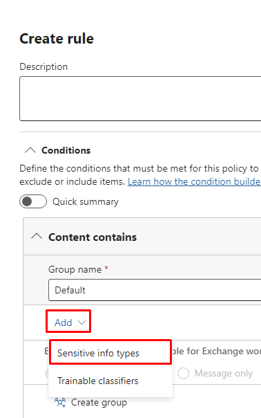

---
lab:
  title: 演習 1 - DLP ポリシーを管理する
  module: Module 2 - Implement Data Loss Prevention
---
## WWL テナント - 使用条件

講師が指導するトレーニング配信の一環としてテナントを提供されている場合は、講師が指導するトレーニングでハンズオンラボをサポートする目的でテナントを利用できることに注意してください。

テナントを共有したり、ハンズオンラボ以外の目的で使用したりしないでください。 このコースで使われるテナントは試用版テナントであり、クラスが終了し、拡張機能の対象となっていない場合は、使用したりアクセスしたりすることはできません。

テナントを有料サブスクリプションに変換することはできません。 このコースの一環として取得したテナントは Microsoft Corporation の財産のままであり、当社はいつでもアクセス権とリポジトリを取得する権利を留保します。

<!--
# Lab 2 - Exercise 1 - Manage DLP Policies
-->

# 演習 4 - DLP ポリシーを管理する

あなたは Contoso Ltd. が新しく採用したコンプライアンス管理者、Joni Sherman です。データ損失防止の目的で、組織の Microsoft 365 テナントを構成する任務を負っています。 Contoso Ltd. は米国で運転指導を提供している会社であり、顧客の機密情報が組織から流出しないようにする必要があります。

## タスク 1 - テスト モード で DLP ポリシーを作成する

この演習では、Microsoft Purview ポータルでデータ損失防止ポリシーを作成し、ユーザーによる機密データの共有を防止します。 作成する DLP ポリシーは、ユーザーがクレジット カード情報を含むコンテンツを共有したい場合に通知を行い、この情報を送信する正当な理由を提供する機会を提供します。 このブロックのアクションがユーザーに影響を与えないよう、このポリシーはテスト モードで実行されます。

1. Client 1 VM (LON-CL1) に **lon-cl1\admin** アカウントでログインします。

<!--
1. In **Microsoft Edge**, navigate to **https://purview.microsoft.com** and sign in to the Microsoft Purview portal as **Joni Sherman**. sign in as JoniS@WWLxZZZZZZ.onmicrosoft.com (where ZZZZZZ is your unique tenant ID provided by your lab hosting provider).  Joni's password should be provided by your lab hosting provider.

1. If the **Stay signed in?** dialog box appears, select the **Don’t show this again** checkbox and then select **No**.
-->

1. **Joni Sherman** としてサインインしている InPrivate Edge ブラウザー画面で、[Purview] タブに移動するか、https://purview.microsoft.com に移動します。

1. 左側のナビゲーション ウィンドウで、**[データ損失防止]** を選択します。

1. **[ポリシー]** を選択します。

1. [ポリシー] ページで **[+ ポリシーの作成]** を選択し、新しいデータ損失防止ポリシーを作成するウィザードを起動します。

1. **[テンプレートの利用またはカスタム ポリシーの作成]** ステップで、**[カテゴリ]** の下の **[カスタム]** を選択し、**[規制]** の下の **[カスタム ポリシー]** を選択します。 [**次へ**] を選択します。

1. **[DLP ポリシーの名前を設定する]** 手順で、以下を入力します。

   - **名前**: クレジット カードの DLP ポリシー
   - **説明**: クレジット カード番号が共有されないよう保護する

1. [**次へ**] を選択します。

1. **[管理単位の割り当て (プレビュー)]** 手順で、 **[次へ]** を選択します。

1. **[ポリシーを適用する場所の選択]** ページで **[Teams のチャットおよびチャネル メッセージ]** チェックボックスのみを有効にし、**[次へ]** を選択します。

    

1. **[ポリシーの設定の定義]** 手順で、**[次へ]** を選択します。

1. **[詳細な DLP ルールをカスタマイズする]** ページで、**[+ ルールの作成]** を選択します。

1. **[ルールの作成]** ポップアップ ページの **[名前]** フィールドに、_「クレジット カード情報」_ と入力します。

1. **[条件]** で、**[+ 条件の追加]** を選択し、ドロップダウン リストから **[次を含むコンテンツ]** を選択します。

1. 新しい **[コンテンツに含まれている]** セクションで、**[追加]** を選択し、ドロップダウン リストから **[機密情報の種類]** を選択します。

    

1. **[機密情報の種類]** 検索フィールドで **[クレジット カード番号]** を選択し、**[追加]** を選択します。

1. **[コンテンツに含まれている]** セクションの下の **[+ 条件の追加]** を選択し、**[Microsoft 365 からコンテンツを共有する]** を選択します。

1. 新しい **[Microsoft 365 からコンテンツを共有する]** セクションで、 **[組織内の連絡先のみ]** オプションを選択します。

1. 下にスクロールし続け、**[+ アクションの追加]** を選択し、**[Microsoft 365 の場所にあるコンテンツへのアクセスを制限またはコンテンツを暗号化する]** を選択します。

1. **[すべてのユーザーをブロックする]** ラジオ ボタンを 選択します。

1. **[ユーザー通知]** セクションまで下にスクロールし、トグルを **[オン]** に切り替えてユーザーへの通知を有効にします。

1. **[ポリシー ヒントを使用して Office 365 サービスでユーザーに通知する]** の横にあるチェックボックスをオンにします。

1. **[ユーザーによる上書き]** セクションで、**[ファブリック (Power BIを含む), Exchange、Sharepoint、OneDrive、Teams でのユーザーによるポリシー制限の上書きを許可します]** のチェックボックスをオンにします。

1. **[上書きするには業務上の理由が必要です]** チェックボックスをオンにします。

1. **[インシデント レポート]** セクションで、**[管理者のアラートとレポートでこの重大度レベルを使用する]** の横にあるドロップダウンを選択し、**[低]** を選択します。

    ![さまざまな [ルールの作成] 設定を参照します。](../Media/create-rule-reference.png)

1. **[保存]** を選択してルールを作成します。

1. **[詳細な DLP ルールをカスタマイズする]** 手順に戻り、**[次へ]** を選択します。

1. **[ポリシー モード]** 手順で、**[シミュレーション モードでポリシーを実行する]** を選択し、**[シミュレーション モード中にポリシー ヒントを表示する]** を選択します。 **[次へ]** を選択します。

1. **[確認して完了]** 手順で設定を確認し、**[送信]** を選択します。

1. 作成したら **[完了]** を選択します。

これで、Microsoft Teams のチャットおよびチャンネルでクレジット カード番号をスキャンし、ポリシーをオーバーライドする業務上の正当な理由をユーザーが提供できるようにする DLP ポリシーが作成されました。

## タスク 2 : DLP ポリシーを修正する

このタスクでは、前の手順で作成した既存の DLP ポリシーを変更して、メールでもクレジット カード情報をスキャンし、メール内のこのコンテンツをユーザーが共有する必要がある場合、ユーザーに通知します。

<!--
1. You should still be signed in to Client 1 VM (LON-CL1) as the **lon-cl1\admin** account, and you should be signed in to Microsoft 365 as **Joni Sherman**.

1. In **Microsoft Edge**, the Microsoft Purview portal tab should still be open. If so, select it and proceed to the next step. If you closed it, then in a new tab, navigate to **https://purview.microsoft.com**.

1. In the Microsoft Purview portal, in the left navigation pane, select **Data Loss Prevention**.

1. Select **Policies**.
-->

1. Purview の [ポリシー] ページで、新しく作成した **[クレジット カードの DLP ポリシー]** の横にあるチェック ボックスをオンにし、 **[ポリシーの編集]** (鉛筆アイコン) を選択してポリシー ウィザードを開きます。

1. **[ポリシーを適用する場所の選択]** ステップが表示されるまで、**[次へ]** を選択します。

1. **[Exchange メール]** オプションのチェックボックスをオンにし、**[確認して完了]** が表示されるまで **[次へ]** を選択します。

1. **[送信]** を選択して、行った変更をポリシーに適用します。

1. ポリシーが更新されたら、**[完了]** を選択します。

既存の DLP ポリシーが修正され、コンテンツを探してスキャンする場所が変更されました。

## タスク 3: PowerShell で DLP ポリシーを作成する

このタスクでは、PowerShell を使用して、Contoso EmployeeID を保護し、それらが Exchange で共有されるのを防止する DLP ポリシーを作成します。 ユーザーには、機密データが共有されようとしていることと、Contoso EmployeeID が含まれるメールの送信はブロックされることが通知されます。

<!--
1. You should still be signed in to Client 1 VM (LON-CL1) as the **lon-cl1\admin** account.

1. In the start menu, select **Windows PowerShell**.

1. In the **PowerShell** window, enter
-->

1. タスク バーから PowerShell ウィンドウを開き、次のように入力します。

    ```powershell
    Connect-IPPSSession
    ```

1. **Joni Sherman**JoniS@WWLxZZZZZZ.onmicrosoft.com としてサインインします (ここで ZZZZZZ はラボ ホスティング プロバイダーから支給された一意のテナント ID です)。  Joni のパスワードは、ラボ ホスティング プロバイダーから支給されます。

1. 次のコマンドを PowerShell に入力し、すべての Exchange メールボックスをスキャンする DLP ポリシーを作成します。

    ```powershell
    New-DlpCompliancePolicy -Name "EmployeeID DLP Policy" -Comment "This policy blocks sharing of Employee IDs" -ExchangeLocation All
    ```

1. 次のコマンドを PowerShell に入力し、前のステップで作成した DLP ポリシーに DLP ルールを追加します。

    ```powershell
    New-DlpComplianceRule -Name "EmployeeID DLP rule" -Policy "EmployeeID DLP Policy" -BlockAccess $true -ContentContainsSensitiveInformation @{Name="Contoso Employee IDs"}
    ```

1. 次のコマンドを使用して、"**EmployeeID の DLP ルール**" を確認します。

    ```powershell
    Get-DLPComplianceRule -Identity "EmployeeID DLP rule"
    ```

これで、PowerShell を使用して Exchange で Contoso EmployeeID をスキャンする DLP ポリシーが作成されました。

## タスク 4: DLP ポリシーをテストする

このタスクでは、前のタスクで作成した DLP ポリシーをテストします。

<!--
1. You should still be signed in to Client 1 VM (LON-CL1) as the **lon-cl1\admin** account and signed in to Microsoft 365 as Joni Sherman.
-->

1. **Joni Sherman** としてサインインしている InPrivate ウィンドウで、タブが既に閉じられている場合は https://outlook.office.com に移動します。

1. 左上にある **[新しいメール]** ボタンを選択して、新しいメール メッセージを作成します。

1. **[宛先]** フィールドに「_Megan_」と入力し、**Megan Bowen** のメール アドレスを選択します。

1. **[件名を追加]** フィールドに、「_従業員情報に関するヘルプ_」と入力します。

1. メールの本文には、次の内容を入力します。

    ``` text
    Please help me with the start dates for the following employees:
    ABC123456
    DEF678901
    GHI234567

    Thank you, 
    Joni Sherman
    ```

1. メッセージ ペインの左上にある **[送信]** ボタンを選択して、メールを送信します。

1. メールが配信不能であり、DLP ポリシーによってブロックされたことを示すメッセージを受信します。

    ![[ロールの管理] オプションのスクリーンショット](../Media/dlp-email-blocked.png)

これで、DLP ポリシーのテストに成功しました。

## タスク 5 - テスト モードでポリシーをアクティブにする

このタスクでは、テストモードで作成したクレジット カード情報の DLP ポリシーをアクティブ化し、保護アクションを強化します。

<!--
1. You should still be signed in to Client 1 VM (LON-CL1) as the **lon-cl1\admin** account, and you should be signed in to Microsoft 365 as **Joni Sherman**.

1. In **Microsoft Edge**, the Microsoft Purview portal tab should still be open. If so, select it and proceed to the next step. If you closed it, then in a new tab, navigate to **https://purview.microsoft.com**.
-->

1. [Purview] タブに移動します。このタブは引き続き **[データ損失防止]** の **[ポリシー]** に表示されているはずです。 そうでない場合は、https://purview.microsoft.com を新しいタブで開き直します。

1. [ポリシー] ページで **[クレジット カードの DLP ポリシー]** の横にあるチェック ボックスをオンにし、**[ポリシーの編集]** (鉛筆) を選択してポリシー ウィザードを開きます。

1. **[ポリシー モード]** ステップが表示されるまで **[次へ]** を選択し、**[ポリシーをすぐに有効にする]** を選択します。 [**次へ**] を選択します。

1. **[確認して完了]** で、**[送信]** を選択します。

1. 更新されたら、**[完了]** を選択します。

DLP ポリシーがアクティブ化されました。 ポリシーはクレジット カード情報を共有しようとする試みを探知すると、それをブロックし、ユーザーにはそのブロックのアクションをオーバーライドする業務上の正当な理由を提供することを許可します。

## タスク 6 : ポリシーの優先順位を修正する

DLP ポリシーを 2 つ作成したところで、より制限の厳しいポリシーが、より制限の緩いポリシーより優先して処理されるようにします。 このため、EmployeeID の DLP ポリシーにより高い優先順位を与えます。

<!--

1. You should still be signed in to Client 1 VM (LON-CL1) as the **lon-cl1\admin** account, and you should be signed in to Microsoft 365 as **Joni Sherman**.

1. In **Microsoft Edge**, the Microsoft Purview portal tab should still be open. If so, select it and proceed to the next step. If you closed it, then in a new tab, navigate to **https://purview.microsoft.com**.

1. In the Microsoft Purview portal, in the left navigation pane, select **Data Loss Prevention**.

1. Select **Policies**.
-->

1. [ポリシー] ページで **[EmployeeID の DLP ポリシー]** の横にある 3 つの縦向きドットを選択して、**[アクション]** リストを開き **[最上位 (最も高い優先度) に移動する]** を選択します。

1. 必要に応じて **[最新の情報に更新]** を選択し、ポリシー テーブルの **[優先度]** 列で優先度を確認します。

DLP ポリシーの優先順位が修正されました。 両方のポリシーが同じコンテンツに一致する場合、より高い優先順位を持つアクションが実行されます。

## タスク 7 : Microsoft Defender でファイルの監視を有効にする

Microsoft Defender のファイル ポリシーを使用し、OneDrive と SharePoint Online の場所にあるファイルを保護します。 ファイル ポリシーを作成するには、組織内のファイルを Microsoft 365 Defender でスキャンできるようにファイル監視を有効にする必要があります。

<!--
1. You should still be signed in to Client 1 VM (LON-CL1) as the **lon-cl1\admin** account.

1. In **Microsoft Edge**, the Microsoft Purview portal tab should still be open. Select the **Profile picture** of Joni Sherman in the top right and select **Sign out**, then close the browser.

1. Open **Microsoft Edge** and navigate to **https://security.microsoft.com** and sign in to the Microsoft 365 Defender portal as **MOD Administrator** admin@WWLxZZZZZZ.onmicrosoft.com (where ZZZZZZ is your unique tenant ID provided by your lab hosting provider). Admin's password should be provided by your lab hosting provider.
-->

1. タスク バーから、**MOD 管理者** admin@WWLxZZZZZZ.onmicrosoft.com としてサインインしている通常の Edge ウィンドウを開きます (ZZZZZZ はラボ ホスティング プロバイダーから提供された一意のテナント ID)。 管理者のパスワードは、ラボ ホスティング プロバイダーから支給されます。

1. 新しいタブで https://security.microsoft.com 移動して、Microsoft Defender ポータルに移動します。

1. 左側のナビゲーションで、下にスクロールして **[システム]** を選択し、サブメニューから **[設定]** を選択します。

1. [**クラウド アプリ**] を選択します。

1. **[クラウド アプリ]** 内の左側のペインで、**[Information Protection]** セクションまで下にスクロールし、**[ファイル]** を選択します。

1. まだマークされていない場合は、 **[ファイル監視を有効にする]** チェックボックスを選択し、 **[保存]** を選択します。

Microsoft 365 Defender でファイル監視が有効になりました。これでファイル ポリシーを使用して、機密性の高いコンテンツのファイルをスキャンできるようになりました。

## タスク 8 : Microsoft Defender のファイル ポリシーを作成する

このタスクでは、Microsoft Defender でファイル ポリシーを作成し、OneDrive と SharePoint Online のファイルをスキャンして、クレジット カード情報を含むファイルが共有されている場合はそのファイルに対して自動的に検疫を行います。

<!--
1. You should still be signed in to Client 1 VM (LON-CL1) as the **lon-cl1\admin** account.

1. In **Microsoft Edge**, the Microsoft Defender for Cloud Apps portal tab should still be open. Select the **Profile picture** of the MOD Admin in the top right and select **Sign out** next to the cogwheel, then close the  browser.

1. Open **Microsoft Edge** and navigate to **https://security.microsoft.com** and sign in to the Microsoft 365 Defender portal as **Joni Sherman** JoniS@WWLxZZZZZZ.onmicrosoft.com (where ZZZZZZ is your unique tenant ID provided by your lab hosting provider). Joni Sherman's password should be provided by your lab hosting provider.
-->

1. Microsoft Defender ポータルの左側のナビゲーションで、**[クラウド アプリ]**、**[ポリシー]**、**[ポリシー管理]** の順に選択します。

1. [ポリシー] ページで、**[+ ポリシーの作成]** を選択し、ドロップダウン リストから **[ファイル ポリシー]** を選択します。

1. **[ポリシー テンプレート]** の選択は **[テンプレートなし]** のままにします。

1. 基本的な詳細については、次の情報を使用します。

   - **ポリシー名**: ファイルのクレジット カード情報
   - **ポリシー重要度**: 低 (単一の点灯アイコン)
   - **カテゴリ**: DLP (ファイル ポリシーの既定値)
   - **説明**: クレジット カード番号がファイルで共有されないよう保護する

1. 下の **[次のすべてに一致するファイル]** セクションで、**[パブリック (インターネット)、外部、パブリック]** の順に選択し、**[内部]** を選択します。

1. **[検査方法]** ドロップダウン リストで、**[データ分類サービス]** を選択します。

1. **[検査の種類を選択]** ドロップダウン リストで **[機密情報の種類]** を選択します。

1. **[機密情報の種類の選択]** ダイアログで、 **[クレジット カード番号]** を選択し、右上隅で **[完了]** を選択します。

1. **[アラート]** で、**[一致したファイルごとにアラートを作成する]** チェックボックスにチェックを入れ、オプションを確認します。 **[既定の設定として保存]** を選択して、設定を既定値として保存します。

1. **[ガバナンス アクション]** セクションで、**[Microsoft OneDrive for Business]** を展開し、**[ユーザー検疫に配置]** を選択します。

1. **[ガバナンス アクション]** セクションで、 **[Microsoft SharePoint Online]** を展開し、 **[ユーザー検疫に配置]** チェックボックスをオンにします。

1. ページの下部にある **[作成]** を選択します。

これで、OneDrive と SharePoint に保存されたファイルを継続的にスキャンしてクレジット カード情報を探し、組織内で共有されている場合に検疫を行うファイル ポリシーが作成されました。

## タスク 9 - Power Platform 向けの DLP ポリシーを作成する

会社では Power Automate のフローを用いて、データを SharePoint Online と Salesforce で共有します。 このタスクでは、既存のフローを続行させつつ、SharePoint Online とビジネス以外として定義されたアプリとの間でデータを共有するフローの作成を防止する、Power Platform 向けの DLP ポリシーを作成します。

<!--
1. Sign in to Client 2 VM (LON-CL2) as the **lon-cl2\admin** account.

1. In **Microsoft Edge**, navigate to **https://admin.powerplatform.microsoft.com** and Sign in to the Power Platform admin center as **MOD Administrator** admin@WWLxZZZZZZ.onmicrosoft.com (where ZZZZZZ is your unique tenant ID provided by your lab hosting provider).  Admin's password should be provided by your lab hosting provider.

-->

1. **MOD 管理者**としてサインインしている同じ通常のブラウザー ウィンドウから、新しいタブを開き、https://admin.powerplatform.microsoft.com に移動して Power Platform 管理センターに移動します。

1. 左側のナビゲーションで、**[ポリシー]** を選択し、サブメニューから **[データ ポリシー]** を選択します。

1. **+ 新しいポリシー** を選択します。

1. **[ポリシーの名前を設定]** ステップで、「_テナント規模の SharePoint ポリシー_」と入力し、**[次へ]** を選択します。

1. **[コネクタの割り当て]** ステップの **[ビジネス以外 | 既定]** タブで、**[SharePoint]** と **[Salesforce]** を選択し、ページの上部で **[ビジネスに移行]** を選択します。

1. **[ビジネス]** タブを選択して、SharePoint と Salesforce の両方が表示されるようにしてから **[次へ]** を選択します。

1. **[Custom connector patterns] (カスタム コネクタ パターン)** ステップで、**[次へ]** を選択します。

1. **[スコープの定義]** ステップで、**[すべての環境の追加]** を選択し、**[次へ]** を選択します。

1. **[ポリシーの確認と作成]** ステップで、ポリシーの設定を確認し、**[ポリシーの作成]** を選択します。

SharePoint Online コネクタと Salesforce でないすべてのコネクタを利用するフローをユーザーが作成することを防止する Power Platform の DLP ポリシーが作成されました。
