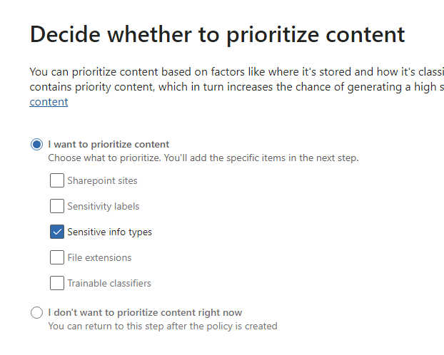

---
lab:
  title: 演習 2 - インサイダー リスク管理を構成する
  module: Module 5 - Manage insider and privacy risk in Microsoft 365
---

<!--
# Lab 5 - Exercise 2 - Configure Insider Risk Management
-->
# 演習 5 - インサイダー リスク管理を構成する

あなたは、Contoso Ltd. のコンプライアンス管理者である Joni Sherman です。あなたのロールには、規制コンプライアンスの維持と、組織内の機密情報の保護が含まれます。 最近、Contoso Ltd. は、会社の評判を損ない、データ セキュリティを侵害し、法的問題につながる可能性があるインサイダー リスクに積極的に対処する必要性を認識しました。

あなたは、インサイダー リスクを効果的に管理するために、Microsoft Purview インサイダー リスク管理を実装します。これは、潜在的なインサイダー脅威を特定し、分析し、対応するために設計された包括的なソリューションです。

## タスク 1: インサイダー リスク管理のロールを割り当てる

この演習では、インサイダー リスク管理のロールを Joni に割り当てて、Microsoft Purview ポータルでインサイダー リスクのタスクを実行するためのアクセス権を付与します。

<!--
1. Sign in to the Client 1 VM (LON-CL1) as the **lon-cl1\admin** account.

1. In Microsoft Edge, navigate to **https://purview.microsoft.com** and sign in to the Microsoft Purview portal as MOD Administrator, **admin@WWLxZZZZZZ.onmicrosoft.com** (where ZZZZZZ is your unique tenant ID provided by your lab hosting provider). Admin’s password should be provided by your lab hosting provider.
-->

1. まだサインインしていない場合は、Client 1 VM (LON-CL1) に **lon-cl1\admin** アカウントとしてサインインします。

1. **MOD 管理者**としてサインインしている通常のブラウザー ウィンドウから、[Purview] タブに移動します。既に閉じている場合は、https://purview.microsoft.com に移動します。

1. 左側のナビゲーションから **[設定]** を選択します。

1. **[ロールとスコープ]** を選択し、サブメニューから **[ロール グループ]** を選択します。

1. 検索するか **[名前]** 列を並べ替えて、一覧から **[インサイダー リスク管理]** を選択します。

1. 右側の **[インサイダー リスク管理]** ポップアップ ページから **[編集]** を選択します。

1. **[ロール グループのメンバーの編集]** ステップで、**[ユーザーの選択]** を選択します。

1. **[ユーザーの選択]** ページで、**[Joni Sherman]** の横にあるチェック ボックスを選択し、**[選択]** ボタンを選択します。

1. **[ロール グループのメンバーの編集]** ステップで、 **[次へ]** を選択します。

1. **[ロール グループを確認して完了]** ステップで、**[保存]** を選択します。

1. 更新されたら、**[完了]** を選択します。

<!--
1. Sign out of the **MOD Administrator** account and close all browser windows.
-->

インサイダー リスク管理のロールを Joni Sherman に正常に割り当て、Microsoft Purview ポータルでインサイダー リスクのタスクを実行するためのアクセス権を付与しました。

## タスク 2: インサイダー リスク設定の構成

このタスクでは、Microsoft Purview ポータルでインサイダー リスク管理設定をカスタマイズします。 これにより、Joni Sherman は、組織内の潜在的なインサイダー リスクを効果的に管理し、機密情報のセキュリティを確保できます。

<!--
1. In **Microsoft Edge**, navigate to **https://purview.microsoft.com** and sign in to the Microsoft Purview portal as JoniS@WWLxZZZZZZ.onmicrosoft.com (where ZZZZZZ is your unique tenant ID provided by your lab hosting provider).
-->

1. **Joni Sherman** としてサインインしている InPrivate Edge ブラウザー画面を開き、[Purview] タブに移動します。既に閉じている場合は、https://purview.microsoft.com に移動します。

1. 左側のナビゲーションから **[設定]** を選択します。

1. **[ソリューションの設定]** セクションで、**[インサイダー リスク管理]** を選択します。

1. 設定を詳しく見てみましょう。

    - **[分析]** : ポリシーの作成をガイドするポリシーを構成せずに、潜在的なインサイダー リスクを評価します。
    - **[データ共有]** : Office 365 管理アクティビティ API を使用して、SIEM ソリューションにリスク アラート情報をエクスポートします。
    - **[インライン アラートのカスタマイズ]** : [アラート] ダッシュボードからポリシーのチューニングとしきい値の調整を直接できるようにします。
    - **[インテリジェントな検出]** : アラートの量を制御し、特定のエンティティをリスク スコアリングから除外し、Microsoft Defender アラートのフィルター処理を可能にします。
    - **[Microsoft Teams]** : インサイダー リスク管理のケースに関して Microsoft Teams でコラボレーションできるようにします。
    - **[通知]** : インサイダー リスク管理のロール グループに電子メール通知を自動的に送信します。
    - **[ポリシー インジケーター]** : 特定のリスク インジケーターを使用したポリシー テンプレートの構成が含まれます。
    - **[ポリシー期間]** : イベントとアクティビティに基づいて、ポリシーの一致によってトリガーされるレビュー期間を定義します。
    - **[Power Automate フロー (プレビュー)]** : Microsoft Power Automate フローを使用してインサイダー リスク管理のタスクを自動化します。
    - **[Priority physical assets] (優先物理資産)** : アクティビティをユーザー イベントに関連付ける優先物理資産へのアクセスを特定し、監視します。
    - **[優先度ユーザー グループ]** : より詳細な検査とより機密性の高いリスク スコアリングを行う、リスクの高いユーザーを決定します。
    - **[プライバシー]** : アラートとケースでユーザー名と匿名化されたバージョンのどちらを表示するかを選択できます。

1. [インサイダー リスク管理の設定] メニューから **[プライバシー]** を選択します。

1. **[Do not show pseudonymized versions of usernames] (仮名化されたバージョンのユーザー名を表示しない)** を選択し、**[保存]** を選択します。

1. [インサイダー リスク管理の設定] メニューから **[ポリシー インジケーター]** を選択します。

1. **[Office インジケーター]** を選択してそのメニューを展開し、**[すべて選択]** のチェック ボックスをオンにし、下にスクロールして **[保存]** を選択します。

1. [インサイダー リスク管理の設定] メニューから **[優先ユーザー グループ]** を選択します。

1. **[+ 優先度ユーザー グループの作成]** を選択して、 **[新しい優先度ユーザー グループ]** ウィザードを開きます。

1. **[優先ユーザー グループの名前と説明]** ステップで、次を入力します。

    - **[名前]**: Finance team
    - **[説明]**: Team members that manage financial operations, budgeting, and reporting

1. [**次へ**] を選択します。

1. **[メンバー]** ステップで **[+ メンバー]** を選択します。

1. **[メンバー]** ペインで、**[Debra Berger]**、**[Lynne Robbins]**、**[Megan Bowen]** の横にあるチェック ボックスを選択し、**[追加]** を選択して 3 人のメンバーを追加します。

1. [**次へ**] を選択します。

1. **[この優先度グループのユーザーが関係するデータを表示できるユーザーの選択]** で、**[+ ユーザーとロール グループの選択]** を選択します。

1. **[ユーザーとロール グループの選択]** ウィンドウで、**[インサイダー リスク管理]** の横にあるチェック ボックスを選択して、Purview でインサイダー リスク管理のロールを持つすべてのメンバーを追加し、**[追加]** を選択します。

1. [**次へ**] を選択します。

1. **[レビュー]** ページで、 **[送信]** を選択します。

1. 作成したら **[完了]** を選択します。 これで、インサイダー リスク管理の設定ページに戻ります。

インサイダー リスク管理設定が正常にカスタマイズされました。 これで、Joni Sherman は、インサイダー リスクを事前に特定して軽減し、Microsoft Purview ポータルで貴重なデータを保護するために必要なツールと機能を使えるようになりました。

## タスク 3: インサイダー リスク ポリシーの作成

このタスクでは、Microsoft Purview で "財務データ保護" という名前のポリシーを構成して、組織内の機密財務データへのアクセスを監視および保護します。

1. 引き続き **Joni Sherman** として Microsoft Purview にサインインしている必要があります。

1. 左側のナビゲーション バーで、**[ソリューション]** を選択し、**[インサイダー リスク管理]** を選択します。

1. [インサイダー リスク管理] メニューから **[ポリシー]** タブを選択します。

1. **[+ ポリシーの作成]** を選びます。

1. **[ポリシー テンプレートの選択]** 手順で、**[データ漏えい]** を選択し、**[次へ]** を選択します。

1. **[ポリシーの名前を設定する]** 手順で、以下を入力します。

    - **[名前]**: Financial Data Protection
    - **[説明]**: Sensitive financial data access monitoring

1. [**次へ**] を選択します。

1. **[ユーザーとグループの選択]** 手順で、**[すべてのユーザー、グループ、アダプティブ スコープ]** を選択したままにして、**[次へ]** を選択します。

1. **[ユーザーとグループの除外 (省略可能)]** 手順で、**[次へ]** を選択します。

1. **[コンテンツに優先順位付けをするかどうかを決定する]** 手順で、**[機密情報の種類]** チェックボックスのみを有効にしたまま、**[次へ]** を選択します。

    

1. **[優先度付けする機密情報の種類]** ステップで、**[+ 機密情報の種類の追加または編集]** を選択します。

1. _[銀行]_ を検索し、**Enter** キーを押します。 **[米国銀行口座番号]** と **[国際銀行口座番号 (IBAN)]** の横にあるチェックボックスをオンにします。 

1. _[クレジット]_ を検索し、**Enter** キーを押します。 **[クレジット カード番号]** の横にあるチェック ボックスをオンにし、**[追加]** を選択します。

1. 3 つの機密情報の種類が追加されていることを確認し、**[次へ]** を選択します。

1. **[優先コンテンツでアクティビティのみをスコア付けするかどうかを決定する]** 手順で、**[すべてのアクティビティのアラートを取得する]** を選択したままにして、 **[次へ]** を選択します。

1. **[このポリシーのトリガー イベントの選択]** 手順で、**[ユーザーが流出アクティビティを実行する]** を選択します。

1. **[このポリシーをトリガーするアクティビティの選択]** で、次のみを選択し有効にします。

   - **[Downloading content from SharePoint] (SharePoint からコンテンツをダウンロードする)**
   - **[Sending email with attachments to recipients outside the organization] (組織外の受信者に添付ファイルを含む電子メールを送信する)**
   - **[Sharing SharePoint files with people outside the organization] (組織外のユーザーと SharePoint ファイルを共有する)**
   - **Microsoft 365 の場所からダウンロードして抽出する**

    >**注**: ポリシーのトリガーを選択できない場合は、インジケーターを有効にするためのヒントが表示される場合があります。 このオプションが表示される場合は、 **[Turn on indicators] (インジケーターを有効にする)** を選択します。 **[Choose indicators to turn on] (インジケーターを選択して有効にする)** ポップアップで、 **[Office インジケーター]** の **[すべて選択]** の横にあるチェック ボックスをクリックし、 **[保存]** を選択します。

    

1. [**次へ**] を選択します。

1. **[イベントをトリガーするしきい値の選択]** 手順で、**[組み込みしきい値の適用]** を選択し、**[次へ]** を選択します。

1. **[インジケーター]** 手順で、**[物理アクセス インジケーター]** を選択し、**[強制終了後または機密資産へのアクセスへの失敗後の物理アクセス]** が選択されている場合は解除して、**[次へ]** を選択します。

1. **[検出オプション]** 手順で、次のセクションで **[すべて選択]** が選択されていることを確認します。

    - **[シーケンス検出]**
    - **[累積流出検出]**
    - **[リスク スコア ブースター]** 
    
1. [**次へ**] を選択します。

1. **[インジケーターのしきい値の種類の選択]** 手順で、**[Microsoft が提供するしきい値を適用する]** を選択し、**[次へ]** を選択します。

1. **[設定を確認して完了]** 手順で、**[送信]** を選択します。

1. 作成したら **[完了]** を選択します。

    >**注:**  このページで説明したように、[アラート] タブにポリシーの一致が表示されるまでに最大 24 時間かかる場合があります。

機密性の高い財務情報への不正アクセスを検出して防止するのに役立つ、"財務データ保護" のポリシーが正常に作成されました。 ポリシーの一致が [アラート] タブに表示されるまでに最大 24 時間かかる場合があります。

## タスク 4: 通知テンプレートを作成する

このタスクでは、Microsoft Purview のインサイダー リスク管理に通知テンプレートを作成します。これにより、リスク アクティビティに対してケースが生成されたときに、アラームとして機能したり、コンプライアンス トレーニングの情報を提供したりする電子メール メッセージをユーザーに自動的に送信できます。

<!--
1. You should still be signed in as Joni in Microsoft Purview in Insider risk management.
-->

1. [インサイダー リスク管理] ナビゲーション メニューで、**[通知テンプレート]** を選択します。

    >オプションが表示されない場合は、ページを更新してみてください。

    ![[通知テンプレート] タブ。](../Media/notice-templates.png)

1. **[通知テンプレートの作成]** を選択します。

1. 次と共に必要な情報を入力します。

    - **[テンプレート名]** : データ漏えいポリシー アラート
    - **[送信元]** : Joni Sherman
    - **[件名]** : データ漏えいの可能性が検出されました
    - **[メッセージ本文]** :

        ````html
        <!DOCTYPE html>
        <html>
        <body>
        <h2>Alert: Potential Data Leak Detected</h2>
        <p>We detected a potential data leak associated with your account. As part of our Insider Risk Management policy, we are required to investigate any suspicious activity related to data breaches.</p>
        <p>Please review your recent actions, report any unusual behavior, and refer to the Contoso User Code of Conduct training at <a href='https://contoso.com'>https://contoso.com</a> for more information.</p>
        <p>Thank you for your cooperation,</p>
        <p><em>Human Resources</em></p>
        </body>
        </html>
        ````

1. **［作成］** を選択します

**データ漏えいポリシー通知**テンプレートが正常に作成され、データ漏えいの可能性が検出されたときに自動通知をユーザーに送信できるようになったため、セキュリティ対策が強化され、Contoso ユーザー行動規範への準拠が促進されました。
