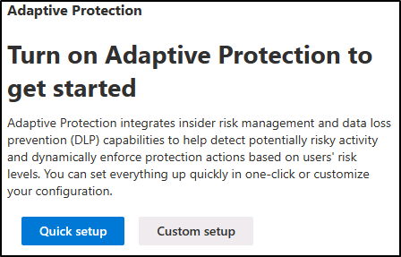
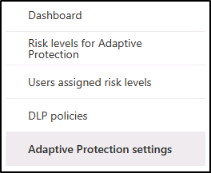

---
lab:
  title: 演習 2 - インサイダー リスク管理を構成する
  module: Module 5 - Manage insider and privacy risk in Microsoft 365
---

<!--
# Exercise 5 - Configure Insider Risk Management
-->
# 演習 6 – 適応型保護

<!-- Need a proper description -->

## タスク 1 - 適応型保護について確認する

このタスクでは、Microsoft Purview インサイダー リスク管理のアダプティブ保護について説明します。 クイックおよびカスタムのセットアップ オプション、カスタマイズ可能なリスク レベル、過去のアクティビティ検出の設定、リスク レベルの期間について説明します。 また、ユーザー固有のリスク レベルと DLP ポリシーを表示するタブを確認し、ポータルでアダプティブ保護機能を有効または無効にする場所を確認します。

1. インサイダー リスク管理では、引き続き **Joni Sherman** として Microsoft Purview にサインインしている必要があります。

1. **[インサイダー リスク管理]** の左側のナビゲーションで **適応型保護** を選択します。

1. 適応型保護を有効にするには、**クイック セットアップと** または **カスタム セットアップ**の 2 つのオプションが表示されます。

    

    >クイック セットアップは、最も早く開始する方法です。 既存の DLP またはインサイダー リスク管理ポリシーは必要ありません。 カスタム セットアップは、ポリシーをより詳細に制御できるため、既存の DLP ポリシーとインサイダー リスク管理ポリシーがある場合にお勧めします。 クイック セットアップの開始には約 72 時間かかりますが、カスタム セットアップは約 36 時間かかります。

1. [適応型保護] で、**[インサイダー リスク レベル]** タブを選択します。

1. アダプティブ保護のカスタマイズ可能なリスク レベルを調べる:

    - **高いリスク レベル**: 重大度の高いアラートまたは複数のリスクの高いアクティビティを持つユーザーにフラグを設定します。
    - **中程度のリスク レベル**: 重大度が中程度のアラートまたは少なくとも 2 件のリスクの高いデータ流出があったユーザーに焦点を当てます。
    - **マイナー リスク レベル**: 重大度の低いアラートまたはリスクの高い単一のデータ流出があるユーザーに対応します。

1. 各リスク レベルには、その横にある [**編集**] ボタンを選択してアクセスできるカスタマイズ オプションがあることに注意してください。

    

1. **過去のアクティビティ検出**と**リスク レベルの時間枠**のオプションを確認します。

    - **過去のアクティビティ検出**: ユーザーの毎日のアクションがリスク レベルの条件を満たしているかどうかを評価するために、5 日から 30 日間のルックバック期間を指定します。
    - **リスク レベルの期間**: リスク レベルが自動リセットされる前に、ユーザーに割り当てられたままになる期間を 5 日から 30 日間の間で決定します。

1. **[適応型保護のリスク レベル]** タブのオプションの確認が完了したら、左側のナビゲーションのウィンドウから **[ユーザー割り当てインサイダー リスク レベル]** タブを選択します。

1. アクティブな場合、これは、各ユーザーの名前または匿名化されたバージョン、現在のリスク レベル、割り当てからの時間、自動リセットまでの日数を表示します。 既存のアラートやケースを削除することなく、リスク レベルを手動で期限切れにできます。 このタブには、各ユーザーの現在のアラートの数と確認済みのケースも表示されます。

1. **[ユーザー割り当てインサイダー リスク レベル]** タブの調査が完了したら、左側のナビゲーションのウィンドウから **[条件付きアクセス]** タブを選択します。

    >このページには、各ポリシーの名前、現在の状態、場所、含まれるリスク レベル、ステータス、作成日、最終更新日が表示されます。

1. **[条件付きアクセス]** タブの調査が完了したら、**[適応型保護設定]** タブを選択します。

    

1. [**アダプティブ保護の設定**] タブでは、機能のオンとオフを切り替えることができます。 オフにすると、リスク レベルの割り当てを停止し、既存のリスク レベルがリセットされ、完全に非アクティブ化されるまで最大 6 時間かかります。 ポリシーは自動的に削除されません。

Insider Risk Management で適応型保護を正しく調査しました。
