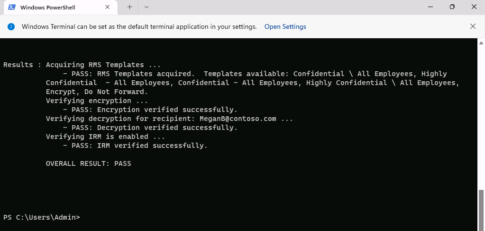
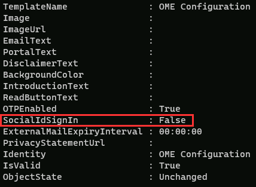

---
lab:
  title: '演習 3 : Microsoft Purview のメッセージ暗号化を管理する'
  module: Module 1 - Implement Information Protection
---

# ラボ 1 : 演習 3: Microsoft Purview メッセージ暗号化を管理する

Contoso Ltd.内で安全な通信を確保するには、Microsoft Purview Message Encryption を構成してテストする必要があります。 これには、既定のテンプレートの変更や、財務部門用の新しいブランド化テンプレートの作成が含まれます。

**タスク**:

1. Azure RMS の機能を確認する
1. 既定のブランド テンプレートを修正する
1. 既定のブランド テンプレートをテストする
1. カスタム ブランド テンプレートを作成する
1. カスタム ブランド テンプレートをテストする

## タスク 1 – Azure RMS の機能を確認する

このタスクでは、テナントの正しい Azure RMS 機能を確認します。

1. 引き続き Client 1 VM (LON-CL1) に **SC-400-CL1\admin** アカウントでログインしている必要があります。

1. タスク バーの Windows ボタンを右クリックして昇格された PowerShell ウィンドウを開き、**[ターミナル (管理者)]** を選択します。

1. **[ユーザー アカウント制御]** ウィンドウで、**[はい]** を選択して確定します。

1. ターミナル ウィンドウで **Install-Module** コマンドレットを実行して、最新の Exchange Online PowerShell モジュール バージョンをインストールします。

    ```powershell
    Install-Module ExchangeOnlineManagement
    ```

1. NuGet プロバイダー セキュリティ ダイアログで、[はい] を示す **[Y]** を選択して確定し、**Enter** キーを押します。 この処理は、完了までに時間がかかる場合があります。

1. 信頼されていないレポジトリ セキュリティ ダイアログで、[はい] を示す **[Y]** を選択して確定し、**Enter** キーを押します。  この処理は、完了までに時間がかかる場合があります。

1. **Set-ExecutionPolicy** コマンドレットを実行して、実行ポリシーを変更し、**Enter** キーを押します。

    ```powershell
    Set-ExecutionPolicy -ExecutionPolicy RemoteSigned -Scope CurrentUser
    ```

1. PowerShell ウィンドウを閉じます。

1. 昇格せずに通常の PowerShell ウィンドウを開き、タスク バーの Windows ボタンを右クリックし、**[ターミナル]** を選択します。

1. **Connect-ExchangeOnline** コマンドレットを実行し、Exchange Online PowerShell モジュールを使用してテナントに接続します。

    ```powershell
    Connect-ExchangeOnline
    ```

1. **[サインイン]** ウィンドウが表示されたら、`JoniS@WWLxZZZZZZ.onmicrosoft.com` としてサインインします (ZZZZZZ はラボ ホスティング プロバイダーから支給された固有のテナント ID)。 前のラボでリセットした Joni のパスワードを使用します。

1. **Get-IRMConfiguration** コマンドレットを実行して、テナントで Azure RMS と IRM がアクティブになっていることを確認します。

    ```powershell
    Get-IRMConfiguration | fl AzureRMSLicensingEnabled
    ```

   **AzureRMSLicensingEnabled** 結果は **True** にする必要があります。

1. **Test-IRMConfiguration** コマンドレットを実行して、ユーザー **Megan Bowen** で Office 365 Message Encryption に使用される Azure RMS テンプレートをテストします

    ```powershell
    Test-IRMConfiguration -Sender MeganB@contoso.com -Recipient MeganB@contoso.com
    ```

    

    すべてのテストが PASS のステータスであり、エラーが表示されていないことを確認します。

1. PowerShell ウィンドウは開いたままにします。

Exchange Online PowerShell モジュールがインストールされ、テナントに接続し、Azure RMS が正しく機能していることを確認しました。

## タスク 2: 既定のブランド テンプレートを修正する

組織からは Google や Facebook などの ID プロバイダーへの信頼を制限する要件が出されています。 既定では、このようなソーシャル ID はメッセージ暗号化で保護されたメッセージにアクセスするためにアクティブ化されているので、組織内のすべてのユーザーに対してソーシャル ID の利用を非アクティブ化する必要があります。

1. Client 1 VM (SC-400-CL1) には **SC-400-CL1\admin** アカウントでログインし、Exchange Online が接続された状態の PowerShell ウィンドウが開いている必要があります。

1. **Get-OMEConfiguration** コマンドレットを実行して、既定の構成を表示します。

    ```powershell
    Get-OMEConfiguration -Identity "OME Configuration" | fl
    ```

   設定を確認して、SocialIdSignIn が **[True]** に設定されていることを確認します。

    

1. **Set-OMEConfiguration** コマンドレットを実行し、OME で保護されたテナントからのメッセージにアクセスするためのソーシャル ID の利用を制限します。

    ```powershell
    Set-OMEConfiguration -Identity "OME Configuration" -SocialIdSignIn:$false
    ```

1. 既定のテンプレートをカスタマイズすることに関する警告メッセージを、[はい] を示す **[Y]** を選択して確定し、**Enter** キーを押します。

1. **Get-OMEConfiguration** コマンドレットを実行して、既定の構成をもう一度確認し、検証します。

    ```powershell
    Get-OMEConfiguration -Identity "OME Configuration" | fl
    ```

    

   結果には、SocialIDSignIn が **False** に設定されていることが示されていることに注意してください。 PowerShell ウィンドウとクライアントは開いたままにします。

Office 365 Message Encryption での Google、Facebook などの海外の ID プロバイダーの利用を非アクティブ化しました。

## タスク 3: 既定のブランド テンプレートをテストする

テナントのユーザーから Office 365 Message Encryption で保護されたメッセージを受信するときに、ソーシャル ID ダイアログが外部の受信者に対して表示されていないことを確認する必要があります。暗号化されたコンテンツにアクセスするときはいつでも OTP を使用する必要があります。

1. Client 1 VM (LON-CL1) に **SC-400-CL1\admin** アカウントでログインしておきます。

1. InPrivate ウィンドウで **Microsoft Edge** を開くには、タスク バーから Microsoft Edge を右クリックし、**[新しい InPrivate ウィンドウ]** を選択します。

1. **`https://outlook.office.com`** に移動し、Outlook on the web に `LynneR@WWLxZZZZZZ.onmicrosoft.com` としてログインします (ZZZZZZ はラボ ホスティング プロバイダーから支給された固有のテナント ID)。 Lynne のパスワードは、前の演習で設定しました。

1. **[サインインの状態を維持しますか?]** ダイアログボックスで、**[今後、このメッセージを表示しない]** チェックボックスをオンにして、**[いいえ]** を選択します。

1. Outlook on the web で、**[新しいメール]** を選択します。

1. **[To]** に、テナント ドメインには存在しない、個人用またはその他サード パーティのメール アドレスを入力します。 メールの件名に「**`Secret Message`**」と入力し、本文には「**`My super-secret message.`**」と入力します。

1. 上部のペインから **[オプション]** を選択した後、 **[暗号化]** を選択してメッセージを暗号化します。 メッセージが正常に暗号化されると、"このメッセージは暗号化されています。 受信者は暗号化を削除できません" のような通知が表示されるはずです。

      

1. **[送信]** を選択してメッセージを送信します。 Outlook ウィンドウは開いたままにしておきます。

1. 新しいウィンドウで個人用のメール アカウントにサインインし、Lynne Robbins からのメッセージを開きます。 Microsoft アカウント (@outlook.com など) にこのメールを送った場合、暗号化は自動的に行われる可能性があり、メッセージが自動的に表示されます。 メールを他のメール サービス (@gmail.com など) に送信した場合、暗号化を処理し、メッセージを読み取る次の手順を実行する必要がある場合があります。

    >**注:** 迷惑メール フォルダーに Lynne Robbins からのメッセージがあるかどうかを確認する必要があるかもしれません。

1. **[メッセージを読む]** を選択します。

1. ソーシャル ID をアクティブにしなければ、Microsoft 以外のアカウントで認証するボタンはありません。

1. **[ワンタイム パスコードを使用してサインイン]** を選択して、制限時間付きパスコードを受け取ります。

1. 個人用のメール ポータルを開き、**"メッセージを表示するためのワンタイム パスコード"** という件名のメッセージを開きます。

1. パスコードをコピーして、OME ポータルに貼り付け、 **[続行]** を選択します。

1. 暗号されたメッセージを確認します。

修正された、既定の OME テンプレートを非アクティブ化したソーシャル ID でテストしました。

## タスク 4 – カスタム ブランド テンプレートを作成する

組織の財務部が送信する、保護されたメッセージには、カスタマイズした導入や本文、フッターの免責事項のリンクなど、特別なブランド化が必要です。 財務のメッセージはまた、7 日経過した後期限切れとします。 このタスクでは、OME 構成を新しくカスタマイズし、財務部が送信するすべてのメールに対しその OME 構成を適用する転送ルールを作成します。

1. Client 1 VM (SC-400-CL1) には **SC-400-CL1\admin** としてログインする必要があり、Exchange Online が接続された状態の PowerShell ウィンドウが開いている必要があります。

1. **New-OMEConfiguration** コマンドレットを実行して、新しい構成を作成します。

    ```powershell
    New-OMEConfiguration -Identity "Finance Department" -ExternalMailExpiryInDays 7
    ```

1. テンプレートのカスタマイズに関する警告メッセージを、[はい] を示す **[Y]** を選択して確定し、**Enter** キーを押します。

1. _IntroductionText_ パラメーターを指定して **Set-OMEConfiguration** コマンドレットを実行し、概要テキストを変更します。

    ```powershell
    Set-OMEConfiguration -Identity "Finance Department" -IntroductionText " from Contoso Ltd. finance department has sent you a secure message."
    ```

1. テンプレートのカスタマイズに関する警告メッセージを、[はい] を示す **[Y]** を選択して確定し、**Enter** キーを押します。

1. _EmailText_ パラメーターを指定して **Set-OMEConfiguration** コマンドレットを実行し、メール本文のテキストを変更します。

    ```powershell
    Set-OMEConfiguration -Identity "Finance Department" -EmailText "Encrypted message sent from Contoso Ltd. finance department. Handle the content responsibly."
    ```

1. テンプレートのカスタマイズに関する警告メッセージを、[はい] を示す **[Y]** を選択して確定し、**Enter** キーを押します。

1. _PrivacyStatementURL_ パラメーターを指定して **Set-OMEConfiguration** コマンドレットを実行し、免責事項の URL を Contoso のプライバシーに関する声明ののサイトを示すように変更します:

    ```powershell
    Set-OMEConfiguration -Identity "Finance Department" -PrivacyStatementURL "https://contoso.com/privacystatement.html"
    ```

1. テンプレートのカスタマイズに関する警告メッセージを、[はい] を示す **[Y]** を選択して確定し、**Enter** キーを押します。

1. **TransportRule** コマンドレットを実行して、財務チームが送信するすべてのメッセージにカスタム OME テンプレートを適用する、メール フロー ルールを作成します。 この処理は、完了するまでに数秒かかる場合があります。

    ```powershell
    New-TransportRule -Name "Encrypt all mails from Finance team" -FromScope InOrganization -FromMemberOf "Finance Team" -ApplyRightsProtectionCustomizationTemplate "Finance Department" -ApplyRightsProtectionTemplate Encrypt
    ```

1. **Get-OMEConfiguration** コマンドレットを実行して、変更を確認します。

    ```powershell
    Get-OMEConfiguration -Identity "Finance Department" | Format-List
    ```

1. 結果を確認したら PowerShell ウィンドウを閉じます

財務部のメンバーが外部の受信者にメッセージを送信する際に、カスタム ブランド テンプレートが自動的に適用される新たなトランスポート ルールが正常に作成されました。

## タスク 5 – カスタム ブランド テンプレートをテストする

新しいカスタム構成を検証するため、財務チームのメンバーである Lynne Robbins のアカウントをもう一度使用する必要があります。

1. Web ウィンドウで InPrivate Outlook を使用して **Microsoft Edge** に移動します。引き続き、**Lynne Robbins** としてログインしている必要があります。

1. Outlook on the web の左上部から **[新しいメール]** を選択します。

1. **[To]** に、テナント ドメインには存在しない、個人用またはその他サード パーティのメール アドレスを入力します。 件名に「**`Finance Report`**」と入力し、メールの本文に「**`Secret finance information.`**」と入力します。

1. **[送信]** を選択してメッセージを送信し、Lynne としてログインしている InPrivate ウィンドウを閉じます。

1. 個人用のメール アカウントにサインインし、Lynne Robbins からのメッセージを開きます。

1. 以下の画像のような Lynne Robbins からのメッセージとなるはずです。  **[メッセージを読む]** を選択します。

    

1. 両方のオプションが利用可能となり、カスタマイズした構成でソーシャル ID がアクティブになりました。 **[ワンタイム パスコードを使用してサインイン]** を選択して、制限時間付きパスコードを受け取ります。

1. 個人用のメール ポータルを開き、**"メッセージを表示するためのワンタイム パスコード"** という件名のメッセージを開きます。

1. パスコードをコピーしてポータルに貼り付け、**[続行]** を選択します。

1. カスタム ブランドの暗号化されたメッセージを確認します。 メール アカウントを開いてウィンドウを閉じます。

新しくカスタマイズされたテンプレートが正常にテストされました。
