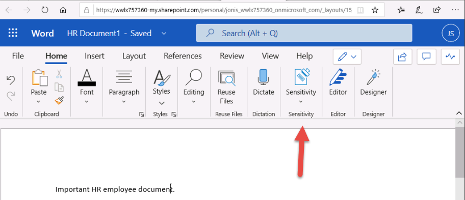
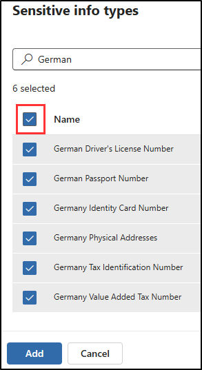

---
lab:
  title: '演習 4: 秘密度ラベルを管理する'
  module: Module 1 - Implement Information Protection
---

# ラボ 1 - 演習 4 - 秘密度ラベルを管理する

Contoso Ltd. のシステム管理者である Joni Sherman は、人事部のすべての従業員ドキュメントが会社の情報保護ポリシーに従って適切にラベル付けされるように、秘密度ラベル付け計画を実装しています。 Contoso Ltd. はドイツの Rednitzhembach に拠点を置き、内部データ処理基準と地域規制に準拠することを目的としています。

**タスク**:

1. 秘密度ラベルのサポートを有効にする
1. 秘密度ラベルを作成する
1. 秘密度ラベルを発行する
1. 機密ラベルの適用
1. 自動ラベル付けを構成する

## タスク 1 - 秘密度ラベルのサポートを有効にする

このタスクでは、必要なモジュールをインストールし、テナントで秘密度ラベルのサポートを有効にします。

1. 引き続き Client 1 VM (LON-CL1) に **SC-400-CL1\admin** アカウントでログインしている必要があります。

1. タスク バーの Windows ボタンを右クリックして昇格された PowerShell ウィンドウを開き、**[ターミナル (管理者)]** を選択します。

1. **[ユーザー アカウント制御]** ウィンドウで **[はい]** をクリックして確認し、Enter キーを押します。

1. **Install-Module** コマンドレットを実行して、最新の MS Online PowerShell モジュール バージョンをインストールします。

    ```powershell
    Install-Module -Name MSOnline
    ```

1. NuGet セキュリティ ダイアログと信頼されていないレポジトリ セキュリティ ダイアログを **Y** (はい) で確認し、Enter キーを押します。 この処理が完了するまでしばらく時間がかかる場合があります。

1. **Install-Module** を実行して、SharePoint Online PowerShell モジュールの最新バージョンをインストールします。

    ```powershell
    Install-Module -Name Microsoft.Online.SharePoint.PowerShell
    ```

1. 信頼されていないリポジトリ セキュリティ ダイアログで "はい" の **Y** を入力して確認し、Enter キーを押します。

1. **Connect-MsolService** を実行し、MS Online サービスに接続します。

    ```powershell
    Connect-MsolService
    ```

1. **[アカウントにサインイン]** フォームで、**Joni Sherman** `JoniS@WWLxZZZZZZ.onmicrosoft.com` としてサインインします (ZZZZZZ はラボ ホスティング プロバイダーから支給された固有のテナント ID)。 Joni のパスワードは、前の演習で設定しました。

1. サインインした後、ターミナル ウィンドウに戻ります。

1. **Get-Msoldomain** コマンドレットを実行し、ドメインを変数として保存します。

    ```powershell
    $domain = get-msoldomain
    ```

1. 前の手順で作成した _$domain_ 変数を使用して、_$adminurl_ の新しい変数を作成します。

    ```powershell
    $adminurl = "https://" + $domain.Name.split('.')[0] + "-admin.sharepoint.com"
    ```

1. 前の手順で作成した _$adminurl_ 変数を使用して、**Connect-SPOService** コマンドレットを実行します。

    ```powershell
    Connect-SPOService -url $adminurl
    ```

1. **[アカウントにサインイン]** フォームで、**MOD 管理者** としてサインインします。 `admin@WWLxZZZZZZ.onmicrosoft.com` (ZZZZZZ はラボ ホスティング プロバイダーから支給された固有のテナント ID)。 管理者のパスワードは、ラボ ホスティング プロバイダーから支給されます。

1. サインインした後、ターミナル ウィンドウに戻ります。

1. **Set-SPOTenant** のコマンドレットを実行入力し、秘密度ラベルのサポートを有効にします。

    ```powershell
    Set-SPOTenant -EnableAIPIntegration $true
    ```

1. "はい" の **Y** を入力して確認し、Enter キーを押します。

1. PowerShell ウィンドウを閉じます。

これで、Teams および SharePoint サイトでの秘密度ラベルのサポートが有効になりました。

## タスク 2 – 秘密度ラベルを作成する

このタスクでは、人事部が HR 従業員ドキュメントに適用する秘密度ラベルを要求しています。 内部ドキュメントの秘密度ラベルと人事部のサブラベルを作成します。

1. 引き続き Client 1 VM (LON-CL1) に **SC-400-cl1\admin** アカウントでログインしている必要があります。

1. **Microsoft Edge** を開き、 **`https://purview.microsoft.com`** に移動します。 Microsoft Purview に **Joni Sherman**`JoniS@WWLxZZZZZZ.onmicrosoft.com` としてサインインします (ここで ZZZZZZ はラボ ホスティング プロバイダーから支給された一意のテナント ID です)。 Joni のパスワードは、前の演習で設定しました。

1. Microsoft Purview ポータルの左サイドバーで、**[ソリューション]** を選択してから、**[情報の保護]** を選択します。

1. **[Microsoft Information Protection]** ページの左サイドバーで、**[秘密度ラベル]** を選択します。

1. **[秘密度ラベル]** ページで **[+ ラベルの作成]** を選択します。

1. **[新しい秘密度ラベル]** 構成が起動します。 **[このラベルの基本的な詳細を指定します]** で、次のように入力します。

    - **名前**: `Internal`
    - **表示名**: `Internal`
    - **ユーザー向けの説明**: `Internal sensitivity label.`
    - **管理者向けの説明**: `Internal sensitivity label for Contoso.`

1. [**次へ**] を選択します。

1. **[このラベルのスコープを定義]** ページで、**[アイテム]** を選択し、**[ファイル]** と **[メール]** を選択します。 **[会議]** のチェック ボックスがオンになっている場合は、選択が解除されていることを確認します。

1. [**次へ**] を選択します。

1. **[ラベル付きのアイテムの保護設定を選択する]** ページで、 **[次へ]** を選択します。

1. **[ファイルと電子メールの自動ラベル付け]** ページで、**[次へ]** をクリックします。

1. **[グループとサイトの保護設定を選択]** ページで、**[次へ]** をクリックします。

1. **[Auto-labeling for schematized data assets (preview)] (スキーマ化されたデータ アセットの自動ラベル付け (プレビュー))** ページで、**[次へ]** を選択します。

1. **[設定の確認と終了]** ページで、**[ラベルの作成]** を選択します。

1. **[秘密度ラベルが作成されました]** ページ上で、**[Don't create a policy yet]** を選択し、**[完了]** を選択します。

1. **[秘密度ラベル]** ページで、新しく作成した**内部**秘密度ラベルを見つけます。 横にある縦の省略記号 (**...**) を選択し、ドロップダウン メニューから **[+ サブラベルの作成]** を選択します。

    ![秘密度ラベルのサブラベルを作成するための [アクション] メニューを示すスクリーンショット。](../Media/create-sublabel-button.png)

1. **[新しい秘密度ラベル]** ウィザードが起動します。 **[このラベルの基本的な詳細を指定します]** で、次のように入力します。

   - **名前**: `Employee data (HR)`
   - **表示名**: `Employee data (HR)`
   - **ユーザー向けの説明**: `This HR label is the default label for all specified documents in the HR Department.`
   - **管理者向けの説明**: `This label is created in consultation with Ms. Jones (Head of HR department). Contact her, when you want to change settings of the label.`

1. [**次へ**] を選択します。

1. **[このラベルのスコープを定義]** ページで、**[アイテム]** を選択し、**[ファイル]** と **[メール]** を選択します。 **[会議]** のチェック ボックスがオンになっている場合は、選択が解除されていることを確認します。

1. [**次へ**] を選択します。

1. [**ラベル付きのアイテムの保護設定を選択する**] ページで、[**制御アクセス権**] オプションを選択し、**[次へ]** を選択します。

1. **[アクセスの制御]** ページで **[Configure access control settings] (アクセス制御設定を構成)** を選択します。

1. 次のオプションを使用して暗号化設定を構成します。

   - **アクセス許可を今すぐ割り当てますか、それともユーザーが決定するようにしますか?** :アクセス許可を今すぐ割り当てる
   - **コンテンツに対するユーザーのアクセス許可の期限**:まったくない
   - **オフライン アクセスを許可する**:数日のみ
   - **ユーザーがコンテンツへオフラインでアクセスできる日数**:15
   - **[アクセス許可の割り当て]** リンクを選択します。 **[アクセス許可の割り当て]** ポップアップ ページで、**[+ 任意の認証済みユーザーを追加]** を選択し、**[保存]** を選択してこの設定を適用します。

1. **[アクセスの制御]** ページで、**[次へ]** を選択します。

1. **[ファイルと電子メールの自動ラベル付け]** ページで、**[次へ]** をクリックします。

1. **[グループとサイトの保護設定を選択]** ページで、**[次へ]** をクリックします。

1. **[Auto-labeling for schematized data assets (preview)] (スキーマ化されたデータ アセットの自動ラベル付け (プレビュー))** ページで、**[次へ]** を選択します。

1. **[設定の確認と終了]** ページで、**[ラベルの作成]** を選択します。

1. **[秘密度ラベルが作成されました]** ページ上で、**[Don't create a policy yet]** を選択し、**[完了]** を選択します。

組織の内部ポリシーの秘密度ラベルと、人事 (HR) 部門の秘密度サブラベルが正常に作成されました。

## タスク 3 – 秘密度ラベルを発行する

次に、内部と人事の秘密度ラベルを発行します。これにより、発行された秘密度ラベルを人事ユーザーが人事ドキュメントに適用できるようになります。

1. Client 1 VM (SC-400-CL1) には **SC-400-cl1\admin** アカウントでログインし、Microsoft Purview には **Joni Sherman** としてログインしておく必要があります。

1. **Microsoft Edge** で、Microsoft Purview ポータルのタブがまだ開かれているはずです。 そうでない場合は、**`https://purview.microsoft.com`** > **[ソリューション]** > **[情報保護]** > **[秘密度ラベル]** に移動します。

1. **[秘密度ラベル]** ページで **[ラベルを発行]** を選択します。

1. 秘密度ラベルの発行構成が起動します。

1. **[発行する秘密度ラベルの選択]** ページで、**[発行する秘密度ラベルの選択]** リンクを選択します。

1. **[発行する秘密度ラベル]** ポップアップ パネルで、**[社内]** と **[内部/従業員データ (HR)]** チェックボックスをオンにし、ポップアップ パネルの下部にある **[追加]** を選択します。

1. **[発行する秘密度ラベルの選択]** ページに戻り、**[次へ]** を選択します。

1. [**管理単位の割り当て**] ページで、[**次へ**] を選択します。

1. **[ユーザーとグループに発行]** ページで **[次へ]** を選択します。

1. **[ポリシー設定]** ページで **[次へ]** を選択します。

1. **[Default settings for documents] (ドキュメントの既定の設定)** で、 **[次へ]** を選択します。

1. **[Default settings for emails] (電子メールの既定の設定)** で、 **[次へ]** を選択します。

1. **[会議とカレンダー イベントの既定の設定]** で、 **[次へ]** を選択します。

1. **[Default settings for Power BI Content] (Power BI コンテンツの既定の設定)** で、 **[次へ]** を選択します。

1. **[ポリシーの名前の設定] ページ**で、以下を入力します。

   - **名前**: `Internal HR employee data`
   - **秘密度ラベル ポリシーの説明を入力してください**: `This HR label is to be applied to internal HR employee data.`

1. [**次へ**] を選択します。

1. **[確認と完了]** ページで、**[送信]** を選択します。

1. **[新しいポリシーが作成されました]** で、 **[完了]** を選択して、ラベル ポリシーの発行を完了します。

内部と人事の秘密度ラベルが正常に発行されました。 なお、変更内容がすべてのユーザーやサービスにレプリケートされるまで、最大で 24 時間かかることがあります。

## タスク 4 : 秘密度ラベルを適用する

このタスクでは、Word と Outlook の電子メールで秘密度ラベルを作成します。 作成されたドキュメントは OneDrive に保存され、電子メールで人事部の従業員に送信されます。

1. Client 1 VM (SC-400-CL1) には **SC-400-cl1\admin** アカウントでログインし、Microsoft 365 には **Joni Sherman**`JoniS@WWLxZZZZZZ.onmicrosoft.com` としてログインしておく必要があります (ZZZZZZ はラボ ホスティング プロバイダーから支給された固有のテナント ID)。 Joni のパスワードは、前の演習で設定しました。

1. **Microsoft Edge** で、左上のミートボール メニューを選択し、**Word** を選択して、新しい Word 文書を開きます。

    ![ミートボール メニューから [Word] を選択する場所を示すスクリーンショット。](../Media/meatball-menu-word.png)

1. **[空白のドキュメント]** を選択して、新しいドキュメントを作成します。

1. **[プライバシー オプション]** ダイアログで、**[閉じる]** を選択します。

1. 新しい空白のドキュメントに次のテキストを入力します。

   `Important HR employee document.`

1. ナビゲーション リボンから **[秘密度]** を選択し、**[社内]** > 、**[従業員データ (HR)]** の順に選択して、新しく作成した秘密度ラベルをこのドキュメントに適用します。

    

    >**注:** 新しく発行された秘密度ラベルがアプリケーションで使用できるようになるまで、24 から 48 時間かかる可能性があります。 新しく作成した秘密度ラベルを使用できない場合は、この演習では **[機密]** - **[全従業員]** を使用できます。

1. ドキュメントの左上にある **[ドキュメント]** を選択し、このファイルの名前を **`HR Document`** に変更します。 Enter キーを押して、この名前の変更を適用します。

    

1. タブを閉じて、[Word Online] タブに戻ります。左上のミートボール メニューを選択し、**[Outlook]** を選択して、Web で Outlook を開きます。

1. Outlook on the web で、**[新しいメール]** を選択します。

1. **"宛先"** フィールドに名前 **`Allan`** を入力し、ドロップダウン リストから **[Allan Deyoung]** を選択します。

1. 件名の行に「**`Employee data for HR`**」と入力します。

1. メールの本文に、次の内容を入力します。

    ``` text
    Dear Mr. Deyoung, 

    Please find attached the important HR employee document. 

    Kind regards,

    Joni Sherman
    ```

1. 上部のナビゲーション リボンからクリップのシンボルを選択して、添付ファイルを追加します。 **[提案されたファイル]** で **HR Document.docx** を選択します。

1. **[送信]** を選択して、ドキュメントが添付された電子メールのメッセージを送信します。

OneDrive に保存された秘密度ラベル付きの HR Word ドキュメントが正常に作成されました。 その後、人事のスタッフ メンバーに電子メールでドキュメントを送付しましたが、その電子メールにも秘密度ラベルが設定されていました。

## タスク 5 - 自動ラベル付けを構成する

このタスクでは、欧州の一般データ保護規則 (GPDR) に関連する情報が含まれていることが検出されたドキュメントや電子メールに自動的にラベルを付ける秘密度ラベルを作成します。

1. 引き続き Client 1 VM (LON-CL1) に **SC-400-cl1\admin** アカウントでログインしている必要があります。

1. **Microsoft Edge** で、 **`https://purview.microsoft.com`** に移動し、**Joni Sherman** として Microsoft Purview ポータルにログインします。

1. Microsoft Purview ポータルで、左側のサイド バーから **[ソリューション]** を選択し、**[情報保護]** を選択します。 **[秘密度ラベル]** を選択します。

1. **[秘密度ラベル]** ページで、新しく作成した**内部**秘密度ラベルを見つけます。 横にある縦の省略記号 (**...**) を選択し、ドロップダウン メニューから **[+ サブラベルの作成]** を選択します。

1. **[新しい秘密度ラベル]** 構成が起動します。 **[このラベルの基本的な詳細を指定します]** で、次のように入力します。

   - **名前**: `GDPR Germany`
   - **表示名**: `GDPR Germany`
   - **ユーザー向けの説明**: `This document or email contains data related to the European General Data Protection Regulation (GPDR) for the region Germany.`
   - **管理者向けの説明**: `This label is auto applied to German GDPR documents.`

1. [**次へ**] を選択します。

1. **[このラベルのスコープを定義]** ページで、**[アイテム]** を選択し、**[ファイル]** と **[メール]** を選択します。 **[会議]** のチェック ボックスがオンになっている場合は、選択が解除されていることを確認します。

1. [**次へ**] を選択します。

1. **[ラベル付きのアイテムの保護設定を選択する]** ページで、 **[次へ]** を選択します。

1. **[ファイルと電子メールの自動ラベル付け]** ページで、**[ファイルと電子メールの自動ラベル付け]** を有効に設定します。

1. **[これらの条件に一致するコンテンツを検出する]** セクションで、**[+条件の追加]** >  を選択し、**[コンテンツに含まれている]** を選択します。

1. **[コンテンツに含まれている]** セクションで、**[追加]** > **[機密情報の種類]** を選択します。

1. **[機密情報の種類]** ポップアップ パネルで、ドイツに関連する機密情報の種類を表示する`German`を検索します。

1. **[名前]** フィールドの横にある、ドイツ語に関連するすべての機密情報の種類を選択し、**[追加]** を選択します。

    

1. [**ファイルと電子メールの自動ラベル付け**] ページで、[**次へ**] をクリックします。

1. **[グループとサイトの保護設定を選択]** ページで、**[次へ]** をクリックします。

1. **[Auto-labeling for schematized data assets (preview)] (スキーマ化されたデータ アセットの自動ラベル付け (プレビュー))** ページで、**[次へ]** を選択します。

1. **[設定の確認と終了]** ページで、**[ラベルの作成]** を選択します。

1. **[秘密度ラベルが作成されました]** ページで、**[ユーザーのアプリにラベルを発行する]** を選択し、**[完了]** を選択します。

1. **[自動ラベル付けポリシーの作成]** ポップアップ パネルで、**[ポリシーのレビュー]** を選択して、新しいラベル ポリシーを作成する構成を開始します。

1. **[自動ラベル付けポリシーの名前を設定] ページ**で、以下を入力します。

   - **名前**: `GDPR Germany policy`
   - **秘密度ラベル ポリシーの説明を入力してください**: `This auto apply sensitivity labels policy is for the GDPR region of Germany.`

1. [**次へ**] を選択します。

1. [**管理単位の割り当て**] ページで、[**次へ**] を選択します。

1. **[ラベルを適用する場所を選択する]** ページで、既定値を選択したまま **[次へ]** を選択します。

1. **[共通または高度なルールの設定]** ページで **[次へ]** を選択します。

1. **[すべての場所のコンテンツのルールを定義する]** ページで、**[次へ]** を選択します。

1. **[ポリシーを今すぐテストするか後でテストするかを決定する]** で、**[シミュレーション モードでポリシーを実行する]** を選択し、**[7 日間変更されていない場合は、ポリシーを自動的にオンにする]** のチェック ボックスをオンにしてから、**[次へ]** を選択します。

1. **[確認と完了]** ページで、**[ポリシーの作成]** を選択します。

1. **[自動ラベル付けポリシーが作成されました]** ページで、**[完了]** を選択します。

ドイツ地域の GDPR ドキュメントに対する自動適用の秘密度ラベルが正常に作成され、発行されました。

自動適用された機密度ラベルが適用されるまでに最大 24 時間かかる場合があります。 この期間は、25,000 を超えるドキュメント (つまり、1 日の上限) に適用すると長くなります。
