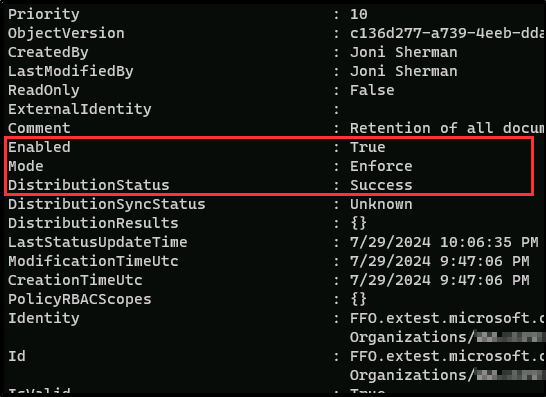

---
lab:
  title: 演習 1 - 保持ポリシーを構成する
  module: Module 3 - Implement Data Lifecycle and Records Management
---

## WWL テナント - 使用条件

講師が指導するトレーニング配信の一環としてテナントを提供されている場合は、講師が指導するトレーニングでハンズオンラボをサポートする目的でテナントを利用できることに注意してください。

テナントを共有したり、ハンズオンラボ以外の目的で使用したりしないでください。 このコースで使われるテナントは試用版テナントであり、クラスが終了し、拡張機能の対象となっていない場合は、使用したりアクセスしたりすることはできません。

テナントを有料サブスクリプションに変換することはできません。 このコースの一環として取得したテナントは Microsoft Corporation の財産のままであり、当社はいつでもアクセス権とリポジトリを取得する権利を留保します。

# ラボ 3: 演習 1: 保持ポリシーを構成する

このラボで、あなたはテキサス州にある Contoso Ltd. のコンプライアンス管理者、Joni Sherman として作業を行います。 あなたのタスクは、州の規制に準拠したアイテム保持ポリシーの実装です。州の規制では、3 年経過後のレコード削除が許可されています。 これらの法的要件に従ってデータを管理および保持できるように、組織全体でさまざまなアイテム保持ポリシーを構成します。

**タスク**:

1. 全社的なアイテム保持ポリシーを作成する
1. 特定のユーザーを選択して Teams アイテム保持ポリシーを作成する
1. PowerShell を使用してアイテム保持ポリシーを作成する
1. 法務ドキュメントと小売ドキュメントのアダプティブ アイテム保持ポリシーを作成する
1. アダプティブ スコープ ポリシーをテストする

## タスク 1: 全社的なアイテム保持ポリシーを作成する

このタスクでは、Microsoft 365 の主要な場所を対象とする全社的なアイテム保持ポリシーを設定し、すべてのアイテムが州法に準拠して 3 年間保持されるようにします。

1. **SC-400-cl1\admin** アカウントで Client 1 VM (SC-400-CL1) にログインします。

1. **Microsoft Edge** で、 **`https://purview.microsoft.com`** に移動して Microsoft Purview ポータルに **Joni Sherman** `JoniS@WWLxZZZZZZ.onmicrosoft.com` としてログインします (ZZZZZZ はラボ ホスティング プロバイダーによって提供される固有のテナント ID)。 Joni のパスワードは、前の演習で設定しました。

1. **[ソリューション]** を選択し、**[データ ライフサイクル管理]** を選択します。

1. **[データ ライフサイクル管理]** ページの左側のサイド バーで、**[ポリシー]** を展開し、**[アイテム保持ポリシー]** を選択します。

1. **[アイテム保持ポリシー]** ページで、**[+ 新しいアイテム保持ポリシー]** を選択します。

1. **[アイテム保持ポリシーの名前を設定]** ページで以下を入力します。

    - **名前**: `Company wide`
    - **説明**: `All locations except for teams`

1. **[次へ]** ボタンを選択します。  

1. **[Policy Scope] (ポリシー スコープ)** ページで、**[次へ]** を選択します。

1. **[作成するアイテム保持ポリシーの種類を選択する]** ページで **[静的]** を選択し、**[次へ]** を選択します。

1. **[このポリシーを適用する場所の選択]** で、以下を選択します。

   - Exchange メールボックス
   - SharePoint クラシック サイトとコミュニケーション サイト
   - OneDrive アカウント
   - Microsoft 365 グループのメールボックスとサイト

1. [**次へ**] を選択します。

1. **[コンテンツを保持するか、削除するか、またはその両方を行うかを決定する]** ページで、保持の構成に次の値が設定されていることを確認します。

   - **[特定の期間アイテムを保持]** を選択します。
   - **[特定の期間アイテムを保持]** の下で、ドロップダウン リストから **[カスタム]** を選択します。
   - [年] フィールドを **[3]** に変更します。
   - **保持期間開始の条件**:アイテムが最後に変更されたとき
   - **[保持期間の終了時]** :アイテムを自動的に削除する

1. [**次へ**] を選択します。

1. **[確認と完了]** ページで、**[送信]** を選択します。

1. ポリシーが作成されたら、**[アイテム保持ポリシーが正常に作成されました]** ページで **[完了]** を選択します。

これで、最終変更日から 3 年間、Microsoft 365 の主要な場所全体でアイテムを保持するアイテム保持ポリシーが正常に作成されました。 このポリシーがテナントに適用されるまでに最大 24 時間かかる場合がありますが、次のステップに進むことができます。

## タスク 2: 特定のユーザーを選択して Teams アイテム保持ポリシーを作成する

次に、Microsoft Teams 専用のアイテム保持ポリシーを作成し、それをチャネル メッセージに適用し、ユーザー チャットを選択して、他のデータとは別に保持を管理します。 組織では、限られた数のユーザーに Teams のチャットの保持期間を要求することにしました。

1. Client 1 VM (SC-400-CL1) には **SC-400-cl1\admin** アカウントでログインし、Microsoft Purview には **Joni Sherman** としてログインしておく必要があります。

1. Microsoft Edge では、引き続き Microsoft Purview ポータルの **[アイテム保持ポリシー]** ページを開いている必要があります。 そうでない場合は、**`https://purview.microsoft.com`** に移動し、**[ソリューション]** を選択したあと **[データ ライフサイクル管理]** を選択します。 左側のサイドバーから **[ポリシー]**、**[アイテム保持ポリシー]** の順に選択します。

1. **[アイテム保持ポリシー]** ページで、**[+ 新しいアイテム保持ポリシー]** を選択します。

1. **[アイテム保持ポリシーの名前を設定]** ページで以下を入力します。

   - **名前**: `Teams Retention`
   - **説明**: `Retention for Teams locations`

1. [**次へ**] を選択します。

1. **[Policy Scope] (ポリシー スコープ)** ページで、**[次へ]** を選択します。

1. **[作成するアイテム保持ポリシーの種類を選択する]** ページで **[静的]** を選択し、**[次へ]** を選択します。

1. **[ポリシーを適用する場所の選択]** ページで、次の場所を有効にします。

   - Teams チャネル メッセージ
   - Teams チャットと Copilot とのやり取り
   - 他のすべての場所は無効のままにします。

1. **[Teams チャットと Copilot とのやり取り]** の場所については、**[すべてのユーザー]** の下の **[編集]** テキスト リンクを選択します。

1. **[Teams チャットと Copilot とのやり取り]** ポップアップ パネルでユーザーを追加します。

    - Adele Vance
    - Pradeep Gupta

    >**注**: これら 2 人のユーザーを追加すると、 **[Teams のチャット]** の **[含まれる]** の設定が *[すべてのチーム]* から *[2 人のユーザー]* に変更されます。

1. ポップアップ パネルの下部にある **[完了]** を選択します。

1. **[ポリシーを適用する場所の選択]** ページに戻り、**[次へ]** を選択します。

1. **[コンテンツを保持するか、削除するか、またはその両方を行うかを決定する]** ページで、保持の構成に次の値が設定されていることを確認します。

   - **[特定の期間アイテムを保持]** を選択します。
   - **[特定の期間アイテムを保持]** の下で、ドロップダウン リストから **[カスタム]** を選択します。
   - [年] フィールドを **[3]** に変更します。
   - **保持期間開始の条件**:アイテムが最後に変更されたとき
   - **[保持期間の終了時]** :アイテムを自動的に削除する

1. [**次へ**] を選択します。

1. **[確認と完了]** ページで、**[送信]** を選択します。

1. **[You successfully created a retention policy] (アイテム保持ポリシーが正常に作成されました)** ページで、**[完了]** を選択します。

1. ブラウザー ウィンドウを閉じます。

Microsoft Teams のアイテム保持ポリシーが正常に構成され、チャネル メッセージと特定のユーザー チャットが 3 年間確実に保持されるようになります。

## タスク 3 - PowerShell でアイテム保持ポリシーを作成する

このタスクでは、PowerShell を使用して同じアイテム保持ポリシーを作成し、ポリシーのセットアップ プロセスを自動化する方法を実地に示します。

1. **SC-400-cl1\admin** アカウントで Client 1 VM (SC-400-CL1) にログインします。

1. タスク バーの Windows ボタンを右クリックして昇格された PowerShell ウィンドウを開き、**[ターミナル (管理者)]** を選択します。 **[ユーザー アカウント制御]** ダイアログが表示される場合は、**[はい]** を選択します。

1. **Connect-IPPSSession**コマンドレットを実行して、テナントのセキュリティ/コンプライアンス センターに接続します。

    ```powershell
    Connect-IPPSSession
    ```

1. サインインを要求するダイアログ ボックスが表示された場合は、**MOD 管理者** `admin@WWLxZZZZZZ.onmicrosoft.com` としてサインインします (ZZZZZZ はラボ ホスティング プロバイダーから提供された固有のテナント ID)。 管理者のパスワードは、ラボ ホスティング プロバイダーから支給されます。

1. **New-RetentionCompliancePolicy** コマンドレットを実行して、Teams を除くすべての場所に対する最初のアイテム保持ポリシーを作成します。

    ```powershell
    New-RetentionCompliancePolicy -Name "Company Wide PS" -ExchangeLocation All -ModernGroupLocation All -SharePointLocation All -OneDriveLocation All
    ```

1. **New-RetentionComplianceRule** コマンドレットを実行して、変更日を基準にした日数を単位として保持期間を 3 年に設定します。

    ```powershell
    New-RetentionComplianceRule -Name "Company Wide PS Rule" -Policy "Company Wide PS" -RetentionDuration 1095 -ExpirationDateOption ModificationAgeInDays -RetentionComplianceAction Keep
    ```

1. **New-RetentionCompliancePolicy** コマンドレットを実行して、Teams の場所に対応する 2 つ目のアイテム保持ポリシーを作成します。

    ```powershell
    New-RetentionCompliancePolicy -Name "Teams Retention PS" -TeamsChannelLocation All -TeamsChatLocation "Adele Vance", "Pradeep Gupta"
    ```

1. **New-RetentionComplianceRule** コマンドレットを実行して、日数を単位として保持期間を 3 年に設定します。

    ```powershell
    New-RetentionComplianceRule -Name "Teams Retention PS Rule" -Policy "Teams Retention PS" -RetentionDuration 1095 -RetentionComplianceAction Keep
    ```

1. ターミナル ウィンドウを閉じます。

PowerShell を使用してアイテム保持ポリシーを正常に作成し、Microsoft Purview ポータルを通じて設定されたポリシーをミラーリングしました。

## タスク 4 - 法務ドキュメントと小売ドキュメントのアダプティブ アイテム保持ポリシーを作成する

次に、財務部門と法務部門のアダプティブ アイテム保持ポリシーを作成し、すべての法務関連ドキュメントが 5 年間確実に保持されるようにします。

1. Client 1 VM (SC-400-CL1) には **lon-cl1\admin** アカウントでログインし、Microsoft 365 には **Joni Sherman** としてログインしておく必要があります。

1. Microsoft Edge を開き、**`https://purview.microsoft.com`** に移動します。 Joni のアカウントでまだログインしていることを確認し、左側のサイドバーから **[設定]** を選択します。

1. **[設定]** ページで、左側のサイドバーから **[ロールとスコープ]** を展開し、**[アダプティブ スコープ]** を選択します。

1. **[アダプティブ スコープ]** ページで、 **[+ スコープを作成]** を選択します。

1. **[アダプティブ ポリシー スコープの名前を設定]** ページで、次を入力します。

    - **名前**: `Legal Documents Retention`
    - **説明**: `Retention for legal related documents`

1. [**次へ**] を選択します。

1. **[管理単位の割り当て]** ページで、 **[次へ]** を選択します。

1. **[作成するスコープの種類]** ページで、 **[ユーザー]** を選択し、 **[次へ]** を選択します。

1. **[ユーザーを定義するクエリの作成]** ページの **[ユーザー属性]** セクションで、ユーザー属性の構成に対してこれらの値が選択されていることを確認します。

   - **[属性]** ドロップダウンを選択し、**[部署]** を選択します
   - 既定値は次のフィールドの値と**同じ**にします
   - **値**として `Legal` を入力します

1. 2 つ目の属性を追加するには、 **[ユーザーを定義するクエリの作成]** ページで **[+ 属性を追加]** を選択します。 先ほど構成した新しいフィールドで、次の値を構成します。

   - クエリ演算子のドロップダウンを選択し、[And] から **[Or]** に更新します
   - **[属性]** ドロップダウンを選択し、**[部署]** を選択します
   - 既定値は次のフィールドの値と**同じ**にします
   - **値**として `Retail` を入力します

1. [**次へ**] を選択します。

1. **[確認と完了]** ページで、**[送信]** を選択します。

1. アダプティブ スコープが作成されたら、**[スコープが作成されました]** ページで **[完了]** を選択します。

1. **[アダプティブ スコープ]** ページに戻り、左側のサイドバーの下部にある **[ソリューション]** を選択します。

1. 上部のフィルター ボタンから **[データ ガバナンス]** のタブを選択します。

1. **データ ライフサイクル管理** カードを選択します。

1. **[データ ライフサイクル管理]** ページの **[ポリシー]** を展開し、**[保持ポリシー]** を選択します。

1. **[保持ポリシー]** ページで、**[+ 新しい保持ポリシー]** を選択します。

1. **[アイテム保持ポリシーの名前を設定]** ページで以下を入力します。

    - **名前**: `Legal Data Retention`
    - **説明**: `Retention of all documents within the legal and retail departments.`

1. [**次へ**] を選択します。

1. **[Policy Scope] (ポリシー スコープ)** ページで、**[次へ]** を選択します。

1. **[作成するアイテム保持ポリシーの種類を選択する]** ページで、 **[アダプティブ]** を選択し、 **[次へ]** を選択します。

1. **[アダプティブ ポリシーのスコープと場所の選択]** ページで、 **[+ スコープを追加]** を選択します。

1. **[アダプティブ ポリシー スコープの選択]** ポップアップ パネルで、**[法的ドキュメントの保持]** のチェックボックスを選択し、パネルの下部にある **[追加]** を選択します。

1. **[ポリシーを適用する場所の選択]** に戻り、次を有効にします。

    - Exchange メールボックス
    - OneDrive アカウント
    - 他のすべての場所は無効のままにします。

1. [**次へ**] を選択します。

1. **[コンテンツを保持するか、削除するか、またはその両方を行うかを決定する]** ページで、保持の構成に次の値が設定されていることを確認します。

   - **[特定の期間アイテムを保持]** を選択します。
   - **[特定の期間アイテムを保持]** の下で、ドロップダウン リストから **[5 年]** を選択します。
   - **保持期間開始の条件**:アイテムが最後に変更されたとき
   - **[保持期間の終了時]** :何もしない

1. [**次へ**] を選択します。

1. **[確認と完了]** ページで、**[送信]** を選択します。

1. ポリシーが作成されたら、**[完了]** を選択します。

1. **[You successfully created a retention policy] (アイテム保持ポリシーが正常に作成されました)** ページで、**[完了]** を選択します。

法的および小売部門のドキュメントを 5 年間カバーする、アダプティブ スコープをアイテム保持ポリシーに正常に適用しました。

## タスク 5 – アダプティブ スコープ ポリシーをテストする

この最後のタスクでは、アダプティブ スコープの影響を受けるユーザーを確認し、新しいアイテム保持ポリシーをテストして、期待どおりに機能していることを確認します。

>**注**: アイテム保持ポリシーを作成して送信すると、アイテム保持ポリシーが適用されるまでに最大 7 日かかることがあります。

1. タスク バーの Windows ボタンを右クリックして、管理者特権の PowerShell ウィンドウを開き、**Terminal (Admin)** を選択します。 **[ユーザー アカウント制御]** ダイアログが表示される場合は、**[はい]** を選択します。

1. **Connect-IPPSSession**コマンドレットを実行して、テナントのセキュリティ/コンプライアンス センターに接続します。

    ```powershell
    Connect-IPPSSession
    ```

1. サインインを要求するダイアログ ボックスが表示された場合は、Joni Sherman のアカウント (`JoniS@WWLxZZZZZZ.onmicrosoft.com`) でサインインします (ZZZZZZ はラボ ホスティング プロバイダーから支給された固有のテナント ID)。 Joni のアカウントは、前の演習で設定されました。

1. **Get-RetentionCompliancePolicy** コマンドレットを実行して、アダプティブ スコープ ポリシーのすべての詳細を表示します。

    ```powershell
    Get-RetentionCompliancePolicy -Identity "Legal Data Retention" -DistributionDetail | Format-List
    ```

1. 結果を確認し、次の詳細を検索します。

    - **有効**: 正
    - **[モード]** :強制
    - **DistributionStatus**:Success

    

アダプティブ スコープ保持ポリシーの正常な実装を確認し、それが正しく適用され、動作していることを確認しました。
