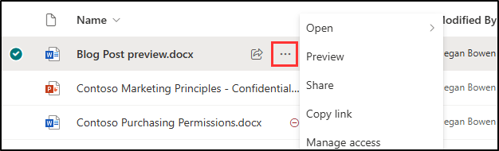
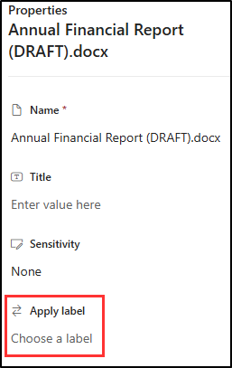

---
lab:
  title: 演習 2 - 保持ラベルを実装する
  module: Module 3 - Implement Data Lifecycle and Records Management
---

# ラボ 3 - 演習 2 - 保持ラベルを実装する

この演習では、英国サドベリーにある Contoso Ltd. のシステム管理者である Joni Sherman のロールを実行します。 同社は、特に財務記録に関する厳格なコンプライアンスとデータ保持基準を遵守することに重点を置いています。 これらのレコードが体系的かつ効率的に管理されるように、付加価値税 (VAT) 還付やクレジット カードの領収書など、重要なドキュメントの保持ラベルの作成と適用を含むファイル 計画を実装します。 これは、Contoso Ltd. が法的要件および内部コンプライアンス要件の両方を満たすのに役立ちます。

**タスク:**

1. ファイル計画を使用して保持ラベルを作成する
1. 保持ラベルを発行する
1. 自動適用保持ラベルを発行する
1. Outlook で保持ラベルを適用する
1. SharePoint で保持ラベルを適用する
1. OneDrive で保持ラベルを適用する

## タスク 1 - ファイル計画を使用して保持ラベルを作成する

このタスクでは、VAT の還付と関連書類の保持ラベルと、クレジット カードの領収書を作成します。 これらのラベルは、会社のコンプライアンス要件に従ってこれらのドキュメントを管理およびセキュリティで保護するための包括的なファイル計画の一部になります。

1. **SC-400-cl1\admin** アカウントで Client 1 VM (SC-400-CL1) にログインします。

1. **Microsoft Edge** で、 **`https://purview.microsoft.com`** に移動して Microsoft Purview ポータルに **Joni Sherman** `JoniS@WWLxZZZZZZ.onmicrosoft.com` としてログインします (ZZZZZZ はラボ ホスティング プロバイダーによって提供される固有のテナント ID)。 Joni のパスワードは、前の演習で設定しました。

1. **Microsoft Purview** ポータルの左サイド バーで **[ソリューション]** を選択し、**[レコード管理]** を選択します。

1. **[レコード管理]** ページの左サイド バーで、**[ファイル計画]** を選択します。

1. **[ファイル計画]** ページで **[+ ラベルの作成]** を選択します。

1. **[保持ラベルに名前を付ける]** ページで、次の情報を入力します。

    - **名前**: `VAT Returns and Supporting Documents`
    - **ユーザー向けの説明**: `Assign this label to VAT Documents to ensure they are retained for the legal period of seven years.`
    - **管理者向けの説明**: `VAT returns with seven-year retention.`

1. [**次へ**] を選択します。

1. **[このラベルのファイル計画記述子の定義]** ページで、次の情報を入力します。

   - **参照 ID**: `VAT-001`
   - **ビジネス機能/部署**: このフィールドの横にある **[選択する]** を選択します。 **[ビジネス機能/部署]** ポップアップ パネルで **[財務]** を選択し、パネルの下部にある **[選択する]** を選択します。
   - **カテゴリ**: このフィールドの横にある **[選択する]** を選択します。 **[カテゴリ]** ポップアップ パネルで、**[+ 新しいカテゴリの作成]** を選択します。 **[カテゴリ]** フィールドに「`Financial records`」と入力し、パネルの下部にある **[追加]** を選択します。
   - **サブ カテゴリ**: このフィールドは空白のままにします。
   - **権限の種類**: このフィールドの横にある **[選択する]** を選択します。 **[権限の種類]** ポップアップ パネルで、**[規制]** を選択し、パネルの下部にある **[選択する]** を選択します。
   - **プロビジョニング/引用**: このフィールドの横にある **[選択する]** を選択します。 **[プロビジョニング/引用]** ポップアップ パネルで、**[米国企業改革法]** を選択し、パネルの下部にある **[選択する]** を選択します。

1. **[このラベルのファイル計画記述子の定義]** ページで、**[次へ]** を選択します。

1. **[Define label settings](ラベル設定の定義)** ページで、 **[Retain items forever or for a specific period](アイテムを無期限に、または特定の期間保持する)** を選んでから、 **[次へ]** を選びます。

1. **[期間の定義]** ページで、保持期間の構成入力に対してこれらの値が設定されていることを確認します。

    - **[How long is the period?](期間の長さ)** : 7 年
    - **[When should the period begin?](期間を開始するタイミング)** : アイテムが作成されたとき

1. [**次へ**] を選択します。

1. **[保持期間中の処理の選択]** ページで **[ユーザーが削除してもアイテムを保持する]** を選択し、**[次へ]** を選択します。

1. **[保持期間後の処理の選択]** ページで **[保持設定の非アクティブ化]** を選択し、**[次へ]** を選択します。

1. **[確認と完了]** ページで、**[ラベルの作成]** を選択します。

1. **[保持ラベルが作成されました]** ページで、**[何も行わない]** オプションを選択してから、**[完了]** を選択します。 ラベルは、後のタスクで発行されます。

1. **[ファイル計画]** ページに戻り、**[+ ラベルの作成]** を選択して別の保持ラベルを作成します。

1. **[保持ラベルに名前を付ける]** で、次を入力します。

    - **名前**: `Credit Card Receipts`
    - **ユーザー向けの説明**: `This label is auto applied to Credit card receipts with a retention period of three years.`
    - **管理者向けの説明**: `Auto applied retention label for Credit card receipts with three-year retention.`

1. [**次へ**] を選択します。

1. **[このラベルのファイル計画記述子の定義]** ページで、次の情報を入力します。

   - **参照 ID**: `CC-002`
   - **ビジネス機能/部署**: このフィールドの横にある **[選択する]** を選択します。 **[ビジネス機能/部署]** ポップアップ パネルで **[営業]** を選択し、パネルの下部にある **[選択する]** を選択します。
   - **カテゴリ**: このフィールドの横にある **[選択する]** を選択します。 **[カテゴリ]** ポップアップ パネルで、**[財務記録]** を選択し、パネルの下部にある **[選択する]** を選択します。
   - **サブ カテゴリ**: このフィールドの横にある **[選択する]** を選択します。 **[サブ カテゴリ]** ポップアップ パネルで、**[+ 新しいサブ カテゴリの作成]** を選択します。 **[サブ カテゴリ]** フィールドに「`Receipts`」と入力し、パネルの下部にある **[追加]** を選択します。
   - **権限の種類**: このフィールドの横にある **[選択する]** を選択します。 **[権限の種類]** ポップアップ パネルで、**[ビジネス]** を選択し、パネルの下部にある **[選択する]** を選択します。
   - **プロビジョニング/引用**: このフィールドの横にある **[選択する]** を選択します。 **[プロビジョニング/引用]** ポップアップ パネルで、**[貸付真実法]** を選択し、パネルの下部にある **[選択する]** を選択します。

1. **[このラベルのファイル計画記述子の定義]** ページで、**[次へ]** を選択します。

1. **[Define label settings] (ラベル設定の定義)** ページで、**[Retain items forever or for a specific period] (アイテムを無期限に、または特定の期間保持する)** を選択し、**[次へ]** を選択します。

1. **[期間の定義]** ページで、保持期間の構成入力に対してこれらの値が設定されていることを確認します。

    - **[Retain items for] (アイテムの保持期間)**: ドロップダウン リストを選択し、**[カスタム]** を選択します。 年に「3」と入力します。
    - **[Start the retention period based on] (保持期間開始の条件)**: アイテムが作成されたとき。

1. [**次へ**] を選択します。

1. **[保持期間中の処理の選択]** ページで **[ユーザーが削除してもアイテムを保持する]** を選択し、**[次へ]** を選択します。

1. **[保持期間後の処理の選択]** ページで **[保持設定の非アクティブ化]** を選択し、**[次へ]** を選択します。

1. **[確認と完了]** ページで、**[ラベルの作成]** を選択します。

1. **[保持ラベルが作成されました]** ページで、**[何もしない]**、**[完了]** の順に選びます。

保持期間が 7 年間の VAT 還付用の保持ラベルと、保持期間が 3 年間のクレジット カードの領収書用の保持ラベルが正常に作成されました。

## タスク 2: 保持ラベルを発行する

VAT 還付の保持ラベルを発行し、財務ユーザーが Exchange メールや SharePoint サイト内の関連ドキュメントに適用できるようにします。

1. Client 1 VM (SC-400-CL1) には **lon-cl1\admin** アカウントでログインし、Microsoft 365 には **Joni Sherman** としてログインしておく必要があります。

1. **[レコード管理]** の **[ファイル計画]** ページがまだ表示されているはずです。 表示されない場合は、`https://purview.microsoft.com` に移動し、左サイド バーから **[ソリューション]** を選択し、**[レコード管理]** を選択します。 **[レコード管理]** ページで、**[ファイル計画]** を選択します。

1. 先ほど作成した **[VAT の還付と関連書類]** ラベルを選択します。

1. **[ラベルの発行]** ボタン (![[ラベルの発行] アイコン](../Media/publish-labels-icon.png)) を選択して、この保持ラベルを発行するための構成を開始します。

1. **[発行するラベルの選択]** ページで、**[VAT の還付と関連書類]** ラベルが選択されていることを確認し、**[次へ]** を選択します。

1. **[Policy Scope] (ポリシー スコープ)** ページで、**[次へ]** を選択します。

1. **[作成するアイテム保持ポリシーの種類を選択する]** ページで **[静的]** を選択し、**[次へ]** を選択します。

1. **[ラベルを発行する場所の選択]** ページで、**[特定の場所を選択]** を選択し、次を選択します。

    - Exchange メールボックス
    - SharePoint クラシック サイトとコミュニケーション サイト
    - OneDrive アカウント
    - 他のすべての場所を選択解除する

1. [**次へ**] を選択します。

1. **[ポリシーの名前を設定する]** で、以下を入力します。

    - **名前**: `VAT Returns and Supporting Documents Retention Label`
    - **説明**: `VAT Returns and supporting documents Retention label, retention period 3 years, Exchange email and SharePoint site locations.`

1. [**次へ**] を選択します。

1. **[完了]** ページで **[送信]** を選択します。  

1. 保持ラベルが発行されたら、**[保持ラベルが発行されました]** ページで **[完了]** を選択します。

VAT の還付と関連書類の保持ラベルが正常に発行されました。

## タスク 3 - 自動適用保持ラベルを発行する

このタスクでは、クレジット カードの領収書の保持ラベルを自動適用するように構成し、関連するドキュメントに必要な期間、自動的にラベル付けされて保持されるようにします。

1. Client 1 VM (SC-400-CL1) には **lon-cl1\admin** アカウントでログインし、Microsoft 365 には **Joni Sherman** としてログインしておく必要があります。

1. **[レコード管理]** の **[ファイル計画]** ページがまだ表示されているはずです。 表示されない場合は、`https://purview.microsoft.com` に移動し、左サイド バーから **[ソリューション]** を選択し、**[レコード管理]** を選択します。 **[レコード管理]** ページで、**[ファイル計画]** を選択します。

1. 前に作成した **[クレジット カードの領収書]** ラベルを選択します。

1. **[ラベルの自動適用]** ボタン (![[ラベルの自動適用] アイコン](../Media/auto-apply-labels-icon.png)) を選択して、この自動適用保持ラベルを発行するための構成を開始します。

1. **[始めましょう]** ページで、次の情報を入力します。

    - **名前**: `Credit Card Receipts auto-applied`
    - **説明**: `Credit Card Receipts auto-applied retention label, with a retention period of three years for all locations.`

1. [**次へ**] を選択します。

1. **[このラベルを適用するコンテンツの種類を選択する]** ページで、**[機密情報が含まれているコンテンツにラベルを適用する]** を選択し、**[次へ]** を選択します。

1. **[機密情報が含まれるコンテンツ]** ページで **[カテゴリ]** の **[財務]** を選択し、次に、**[規制]** の **[英国財務データ]** を選択します。

1. [**次へ**] を選択します。

1. **[機密情報が含まれているコンテンツを定義する]** ページで、**[次へ]** を選択します。

1. **[Policy Scope] (ポリシー スコープ)** ページで、**[次へ]** を選択します。

1. **[作成するアイテム保持ポリシーの種類を選択する]** ページで **[静的]** を選択し、**[次へ]** を選択します。

1. **[ポリシーを適用する場所の選択]** ページで、次の場所を選択します。

    - Exchange メールボックス
    - SharePoint クラシック サイトとコミュニケーション サイト
    - OneDrive アカウント
    - Microsoft 365 グループのメールボックスとサイト

1. [**次へ**] を選択します。

1. **[自動適用するラベルを選択する]** ページで、**[クレジット カードの領収書]** ラベルが選択されていることを確認し、**[次へ]** を選択します。

1. **[ポリシーをテストするか実行するかを決定する]** で、**[ポリシーをオンにする]** を選択して、**[次へ]** を選択します。

1. **[確認と完了]** ページで、**[送信]** を選択します。

1. 自動ラベル付けポリシーが作成されたら、**[自動ラベル付けポリシーが作成されました]** で **[完了]** を選択します。 のページを参照してください。

1. 右上隅の画像を選択し、**[サインアウト]** を選択して、Joni のアカウント からサインアウトします。

これで、**[クレジット カードの領収書]** 保持ラベルが自動適用するように構成され、識別されたすべてのドキュメントに 3 年間の保持期間が設定されました。

## タスク 4 - Outlook で保持ラベルを適用する

Contoso Ltd. の財務アナリストである Megan Bowen は、Outlook の特定の電子メールとフォルダーが会社のデータ保持ポリシーに準拠していることを確認する必要があります。 このタスクでは、適切な保持ラベルを Outlook アイテムに適用します。

1. **SC-400-cl1\admin** アカウントで Client 1 VM (SC-400-CL1) にログインします。

1. **Microsoft Edge** で、 **`https://outlook.office.com`** に移動します。 **Megan Bowen**`MeganB@WWLxZZZZZZ.onmicrosoft.com` としてサインインします (ここで ZZZZZZ はラボ ホスティング プロバイダーから支給された一意のテナント ID です)。 Megan のパスワードは、前の演習で設定しました。

1. Megan の受信トレイで、任意の電子メールを右クリックし、**[保持ラベル]** セクションの下にある **[高度なアクション]** > 、**[ポリシーの割り当て]** > 、**[5 年で削除]** を選択します。

   この保持ラベルは、選択した電子メールに 5 年間の保持期間を割り当てます。 5 年間が経過すると、アイテムは削除されます。

1. 引き続き Outlook で、左サイド バーから **[受信トレイ]** を展開し、**[Project Falcon]** フォルダーを右クリックします。

1. 右クリックしたときに表示されるメニューから、**[保持ラベル]** セクションの下にある **[高度なアクション]** > 、**[ポリシーの割り当て]** > 、**[5 年で削除]** を選択します。

   この保持ラベルは、Project Falcon フォルダーとそのすべてのコンテンツに 5 年間の保持期間を割り当てます。 5 年間が経過すると、アイテムは削除されます。

Outlook のメールとフォルダーに対して正常に保持ラベルを適用しました。

## タスク 5 – SharePoint の保持ラベルを適用する

財務アナリストとして、Megan Bowen は SharePoint で機密ドキュメントを管理します。 このタスクでは、SharePoint ライブラリ内の特定のドキュメントに保持ラベルを適用し、ドキュメントのリテンション期間が会社のポリシーと一致するようにします。

1. 引き続き Client 1 VM (LON-CL1) に **SC-400-cl1\admin** アカウントでログインしている必要があります。

1. 引き続き、Megan Bowen として Outlook にログインしている必要があります。 左上にあるミートボール メニューを選択し、**[SharePoint]** を選択して SharePoint に移動します。

   ![ミートボール メニューから [SharePoint] を選択する場所を示すスクリーンショット](../Media/meatball-menu-sharepoint.png)

1. SharePoint ランディング ページで `Communication site` を検索し、検索結果から **[コミュニケーション サイト]** を選択します。

1. 上部のナビゲーション バーで、 **[ドキュメント]** タブを選択します。

1. **[CAS]** フォルダーを選択します。

1. CAS フォルダー内で、**Blog Post preview.docx** ドキュメントの上にマウス ポインターを置き、**[その他のアクションの表示]** の省略記号 **[...]** を選択してメニューを開き、その他のオプションを表示します。

   

1. アクション メニューから **[詳細]** > **[コンプライアンスの詳細]** を選択します。

1. ドキュメントの **[Compliance details] (コンプライアンスの詳細)** を表示する新しいウィンドウが開きます。 **[ラベルの状態]** で **[なし]** を選択して、**[ラベルの適用]** ウィンドウを開きます。

   

1. **[ラベルの適用]** ページで、 **[ラベルの適用]** ドロップダウンを選択し、**[なし]** から **[VAT の還付と関連書類 (7 年間保持)]** に変更します。 画面の上部で **[保存]** を選択します。

   >**注**: 保持ラベルが SharePoint に表示されるまでに 1 日から 2 日かかる場合があります。 このタスク中に **[VAT の還付と関連書類 (7 年間保持)]** ラベルを使用できない場合は、後で再検討してラベルを適用できます。

SharePoint のドキュメントに正常に保持ラベルを適用しました。

## タスク 6 – OneDrive の保持ラベルを適用する

Megan Bowen はリモートで作業しながら、重要な財務ドキュメントを OneDrive に格納します。 このタスクでは、保持ラベルを適用して、これらのドキュメントが会社のアイテム保持ポリシーに従って管理されるようにします。

1. 引き続き Client 1 VM (LON-CL1) に **SC-400-cl1\admin** アカウントでログインしている必要があります。

1. 引き続き、Megan Bowen として Outlook にログインしている必要があります。 左上のミートボール メニューを選択し、 **[OneDrive]** を選択して OneDrive に移動します。

1. 左側のサイドバーから **[Myファイル]** を選択します。 ファイルの一覧が表示されたら、**年額レポート**上にマウス ポインターを置き、**[その他のアクション]** の省略記号 **[...]** を選択してメニューを開き、その他のオプションを表示します。

1. アクション メニューから **[詳細]** を選択して、右側の詳細パネルを開きます。

1. **[プロパティ]** でスクロールして **[ラベルの適用]** セクションを見つけます。 **[ラベルの選択]** を選んで、**[VAT の還付と関連書類]** を選択します (利用可能な場合)。

   

   >**注**: 保持ラベルが OneDrive に表示されるまでに 1 日から 2 日かかる場合があります。 このタスク中に **[VAT の還付と関連書類 (7 年間保持)]** ラベルを使用できない場合は、後で再検討してラベルを適用できます。

1. 詳細パネルの上部にある **[]** を選択して閉じます。 ここで行った変更は自動的に適用されます。

1. 右上にある Megan のアイコンを選んでから **[サインアウト]** を選択し、そのアカウントからサインアウトします。

OneDrive のドキュメントに正常に保持ラベルを適用しました。
