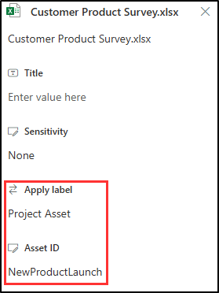

---
lab:
  title: '演習 3: イベント ベースの保持を構成する'
  module: Module 3 - Implement Data Lifecycle and Records Management
---

# ラボ 3 - 演習 3 - イベント ベースの保持を構成する

この演習でのあなたの役割は、Contoso Ltd. のコンプライアンス管理者 Joni Sherman です。あなたの組織はテキサスにあり、特定のプロジェクトに属するコンテンツを終了後 5 年間保持するための保持ポリシーを実装する必要があります。

1. イベント駆動の保持ラベルとイベントの種類を作成する
1. イベント駆動の保持ラベルを発行する
1. ラベルを適用して資産 ID を追加する
1. 特定のイベントを作成する
1. イベント トリガーの結果を観察する

## タスク 1 – イベント駆動の保持ラベルとイベントの種類を作成する

この手順では、保持ラベルとイベントの種類を作成します。 イベントの種類によって、保持期間がトリガーされます。 その特定のイベントの種類に対して保持ラベルが適用されているコンテンツには、そのラベルの保持アクションが適用されます。

1. 引き続き Client 1 VM (SC-400-CL1) に **SC-400-cl1\admin** としてログインしている必要があります。

1. **Microsoft Edge** で、 **`https://purview.microsoft.com`** に移動して Microsoft Purview ポータルに **Joni Sherman** `JoniS@WWLxZZZZZZ.onmicrosoft.com` としてログインします (ZZZZZZ はラボ ホスティング プロバイダーによって提供される固有のテナント ID)。 Joni のパスワードは、前の演習で設定しました。

1. **Microsoft Purview** ポータルの左サイド バーで **[ソリューション]** を選択し、**[レコード管理]** を選択します。

1. **[レコード管理]** ページで、左側のサイドバーから **[ファイル計画]** を選択し、**[ラベルの作成]** を選択します。

1. **[保持ラベルに名前を付ける]** で、次を入力します。

    - **名前**: `Project Asset`
    - **ユーザー向けの説明**: `Assign this label to project documents to ensure they are retained for the period of 5 years.`
    - **管理者向けの説明**: `Project asset for event-based retention.`

1. [**次へ**] を選択します。

1. **[このラベルのファイル計画記述子の定義]** で、このページを空白にしたままで、**[次へ]** を選択します。

1. **[Define label settings](ラベル設定の定義)** ページで、 **[Retain items forever or for a specific period](アイテムを無期限に、または特定の期間保持する)** を選んでから、 **[次へ]** を選びます。

1. **[保持期間の定義]** ページで、**[アイテムを保持]** のドロップダウンを選択し、**"5 年"** を選びます。

1. **[以下に基づき保持期間を開始する]** ドロップダウンで、**[+ 新しいイベントの種類の作成]** を選びます。 これにより、イベントベースのラベル構成が開始されます。

1. 右側の **[イベントの種類に名前を付ける]** ポップアップ パネルで、次の情報を入力します。

    - **名前**: `Project Closure`
    - **説明**: `This event will be triggered when a project closes.`

1. [**次へ**] を選択します。

1. **[概要]** ページを確認し、**[送信]** を選びます

1. **[イベントの種類が作成されました]** ページで、**[完了]** を選択します。

1. **[保持期間の定義]** に戻り、**[以下に基づき保持期間を開始する]** のドロップダウンを選択して、新しく作成したイベントの種類 **[プロジェクトの完了]** を選択します。

1. [**次へ**] を選択します。

1. **[保持期間中の処理の選択]** ページで **[アイテムをレコードとしてマークする]** を選択し、**[このレコードを既定でロック解除する]** のオプションを選択します。

1. [**次へ**] を選択します。

1. **[Choose what happens after the retention period](保持期間後の処理の選択)** ページで **[Delete items automatically](アイテムを自動的に削除する)** を選んで、 **[次へ]** を選びます。

1. **[確認と完了]** ページで、**[ラベルの作成]** を選びます。  

1. **[保持ラベルが作成されました]** ページで、**[何もしない]**、**[完了]** の順に選びます。

イベント ベースの保持ラベルが正しく作成されました。

## タスク 2 – イベント駆動の保持ラベルを発行する

このタスクでは、プロジェクト資産の保持ラベルを発行して、ユーザーが SharePoint および OneDrive の関連ドキュメントに適用できるようにします。

1. Client 1 VM (SC-400-CL1) には **SC-400-cl1\admin** アカウントでログインし、Microsoft Purview には **Joni Sherman** としてログインしておく必要があります。

1. 引き続き Microsoft Purview 内の **[ファイル計画]** ページにいる必要があります。 そうでない場合は、`https://purview.microsoft.com` に移動し、**[ソリューション]** - **[レコード管理]** - **[ファイル計画]** の順に選択します。

1. **[プロジェクト資産]** ラベルを選択して、**[ラベルの発行]** ボタン () を選びます。

1. **[発行するラベルを選択]** ページで、**[プロジェクト資産]** 保持ラベルが選択されていることを確認し、**[次へ]** を選択します。

1. **[ポリシー スコープ]** ページで、**[次へ]** を選びます。

1. **[作成するアイテム保持ポリシーの種類を選択する]** ページで **[静的]** を選び、**[次へ]** を選びます。

1. **[ラベルを発行する場所の選択]** ページで、**[特定の場所を選択]** を選び、以下を有効にします。

1. **[ラベルを発行する場所の選択]** ページで、**[特定の場所を選択]** を選択し、次を選択します。

    - SharePoint クラシック サイトとコミュニケーション サイト
    - OneDrive アカウント
    - 他のすべての場所を選択解除する

1. [**次へ**] を選択します。

1. **[ポリシーの名前を設定する]** で、以下を入力します。

    - **名前**: `Project Asset Retention Label`
    - **説明**: `Project Assets Retention label, retention period 5 years, SharePoint site locations.`

1. [**次へ**] を選択します。

1. **[完了]** ページで設定を確認し、**[送信]** を選択します。

1. 保持ラベルが発行されたら、**[保持ラベルが発行されました]** ページで **[完了]** を選択します。

プロジェクト アセットの保持ラベルが正常に発行されました。

## タスク 3 - ラベルを適用してアセット ID を追加する

このタスクでは、プロジェクト アセットの保持ラベルをドキュメントに適用して、アセット ID を割り当てます。この ID は、関連するプロジェクト イベントが発生した後に保持期間をトリガーするのに使用されます。

1. Client 1 VM (SC-400-CL1) には **lon-cl1\admin** アカウントでログインし、Microsoft 365 には **Joni Sherman** としてログインしておく必要があります。

1. 引き続き Microsoft Purview 内の **[ファイル計画]** ページにいる必要があります。 左上隅にあるミートボール メニューを選択し、サブメニューから **[SharePoint]** を選択します。

   

1. 上部にある検索バーで "`Brand`" を検索し、検索結果から **[ブランド]** SharePoint ページを選択します。

1. 上部のナビゲーション ウィンドウで **[ドキュメント]** を選択します。

1. ドキュメント フォルダー内で、**Customer Product Survey.xlsx** ドキュメントにカーソルを合わせ、**[その他のアクションを表示する]** を表す 3 点リーダー **...** を選択し、メニューを開いて他のオプションを表示し、**[詳細]** を選択します。

1. 右側のパネルの **[プロパティ]** で、**[ラベルの適用]** を選択し、**プロジェクト アセット** ラベルを選択します。

   >**注**: 保持ラベルが SharePoint に表示されるまでに 1 日から 2 日かかる場合があります。 このタスク中に **プロジェクト アセット** ラベルを使用できない場合は、後でまた来てラベルを適用することができます。

1. 新しく表示された **"アセット ID"** フィールドに「**`NewProductLaunch`**」と入力し、右上隅の **[X]** を選択して右側のメニューを閉じます。

   

ドキュメントに対し、プロジェクト アセット ラベルの適用とアセット ID の割り当てが正常に行われました。 このセットアップでは、プロジェクトの終了イベントが発生したときに保持プロセスが開始されます。

## タスク 4 – 特定のイベントを作成する

このタスクでは、プロジェクトの終了をマークする特定のイベントを作成し、ラベル付けされたすべてのドキュメントの保持期間をトリガーします。

1. Client 1 VM (SC-400-CL1) には **lon-cl1\admin** アカウントでログインし、Microsoft 365 には **Joni Sherman** としてログインしておく必要があります。

1. **Microsoft Edge** で、**`https://purview.microsoft.com`** にアクセスし、左側のサイド バーから **[ソリューション]**、**[レコード管理]** の順に選択します。

1. **[レコード管理]** ページで、左側のサイド バーから **[イベント]** を選択します。

1. **[イベント]** ページで **[作成]** を選択します。

1. 右側の **[イベントに名前を設定する]** ポップアップ パネルで、次の内容を入力します。

    - **名前**: `New Product Launch Closed`
    - **説明**: `Assets with the Project Asset label and AssetID NewProductLaunch will enter their retention period.`

1. [**次へ**] を選択します。

1. **[イベントの設定]** ページで、**[イベントの種類を使う]** を選び、**[イベントの種類を選択]** を選びます。

1. **[イベントの種類を選択]** ページで、"**プロジェクトの完了**" をび、**[追加]** を選びます。

1. ポップアップ パネルで **[次へ]** を選択します。

1. **[イベントの設定]** ページで、**SharePoint と OneDrive のアイテムのアセット ID** を **`NewProductLaunch`** に設定します。

1. **[このイベントが発生した日時]** で今日の日付を選び、**[次へ]** を選びます。

1. **[完了]** ページを確認し、**[送信]** を選びます。

1. **[イベントが作成されました]** ページで、**[完了]** を選択します。

イベントが正常にトリガーされ、"プロジェクト資産" ラベルと資産 ID NewProductLaunch が設定されたすべてのドキュメントの保持期間を開始しました。

## タスク 5 – イベント トリガーの結果を観察する

指定した保持期間が開始したことを確認するには、ファイルを削除してみる必要があります。

1. Client 1 VM (SC-400-CL1) には **lon-cl1\admin** アカウントでログインし、Microsoft 365 には **Joni Sherman** としてログインしておく必要があります。

1. Microsoft Edge では、Microsoft Purview ポータルのレコード管理用の **[イベント]** ページに引き続き表示されます。

1. 左上隅にある 9 つのドットを選び、 **[アプリ]** で **[SharePoint]** を選びます。

1. 上部にある検索バーで "`Brand`" を検索し、検索結果から **[ブランド]** SharePoint ページを選択します。

1. 上部のナビゲーション ウィンドウで **[ドキュメント]** を選びます。

1. **[ドキュメント]** ページで、**Customer Product Survey.xlsx** のチェックボックスをオンにし、横の省略記号 **...** を選択して [操作] メニューを開きます。

1. [操作] メニューの **[削除]** を選んで、結果を確認します。 ポリシーにより、このファイルの削除をブロックする必要があります。

   

ドキュメントの保持期間が正常に開始されたことが確認されました。 ドキュメントをまだ削除できる場合は、イベントの同期期間が完了しておらず、保持ポリシーのトリガーがまだ進行中です。 他の保持ラベルと同様に、このプロセスが完了するまで最大で 1 日から 2 日かかることがあります。
